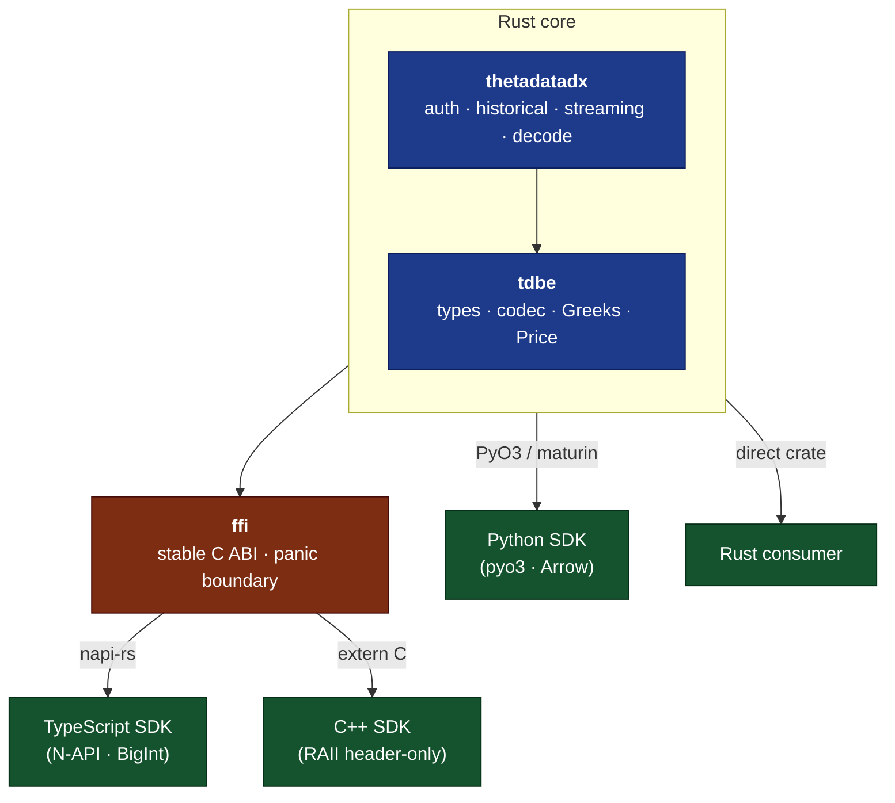

# ThetaDataDx

Native Rust SDK for [ThetaData](https://thetadata.us) market data.
Single Rust core, four language surfaces (Rust, Python, TypeScript,
C++), three transports (gRPC historical, TCP streaming, daily blobs).
No JVM, no subprocess, no IPC serialization.

[](https://github.com/userFRM/ThetaDataDx/actions/workflows/ci.yml)
[](./LICENSE)
[](https://crates.io/crates/thetadatadx)
[](https://pypi.org/project/thetadatadx)
[](https://www.npmjs.com/package/thetadatadx)
[](https://docs.rs/thetadatadx)
[](https://discord.thetadata.us/)

> [!IMPORTANT]
> A valid [ThetaData](https://thetadata.us) subscription is required.
> The SDK authenticates against ThetaData's Nexus API using your account
> credentials.

## Requirements

- Rust 1.88 or newer (declared on every workspace `[package]`; CI lint
  pinned to this floor).
- A valid [ThetaData](https://thetadata.us) subscription for the live
  endpoints.

## Quick start

> [!TIP]
> Credentials can be supplied as a `creds.txt` file (email on line 1,
> password on line 2), inline via `Credentials::new("email", "password")`,
> or through the `THETADATA_EMAIL` / `THETADATA_PASSWORD` environment
> variables.

### Rust

```toml
[dependencies]
thetadatadx = "11"
tokio = { version = "1", features = ["rt-multi-thread", "macros"] }
```

```rust
use thetadatadx::{ThetaDataDxClient, Credentials, DirectConfig};

#[tokio::main]
async fn main() -> Result<(), thetadatadx::Error> {
    let creds = Credentials::from_file("creds.txt")?;
    let tdx = ThetaDataDxClient::connect(&creds, DirectConfig::production()).await?;
    for tick in &tdx.stock_history_quote("AAPL", "20240101", "20240301").await? {
        println!("{}: bid={} ask={}", tick.ms_of_day, tick.bid, tick.ask);
    }
    Ok(())
}
```

Opt into chainable DataFrame ergonomics with the `polars` and/or
`arrow` features. Both stay out of the default dep graph:

```toml
[dependencies]
thetadatadx = { version = "11", features = ["polars"] }
```

```rust
use thetadatadx::frames::TicksPolarsExt;

let eod = tdx.stock_history_eod("AAPL", "20240101", "20240301").await?;
let df = eod.as_slice().to_polars()?;
```

### Python

```sh
pip install thetadatadx
```

```python
from thetadatadx import Credentials, Config, ThetaDataDxClient

tdx = ThetaDataDxClient(Credentials.from_file("creds.txt"), Config.production())
for tick in tdx.stock_history_quote("AAPL", "20240101", "20240301"):
    print(f"{tick.ms_of_day}: bid={tick.bid:.2f} ask={tick.ask:.2f}")
```

### TypeScript / Node.js

```sh
npm install thetadatadx
```

```typescript
import { ThetaDataDxClient } from 'thetadatadx';

const tdx = await ThetaDataDxClient.connectFromFile('creds.txt');
for (const t of tdx.stockHistoryQuote('AAPL', '20240101', '20240301')) {
    console.log(`${t.msOfDay}: bid=${t.bid} ask=${t.ask}`);
}
```

### C++

```cpp
#include <thetadx.hpp>
#include <cstdio>

int main() {
    auto creds  = tdx::Credentials::from_file("creds.txt");
    auto config = tdx::Config::production();
    auto client = tdx::Client::connect(creds, config);
    for (const auto& t : client.stock_history_quote("AAPL", "20240101", "20240301")) {
        std::printf("%d: bid=%.2f ask=%.2f\n", t.ms_of_day, t.bid, t.ask);
    }
}
```

## What's new in v11.0.0

The v11 cut absorbs 30 major + 1 minor breaking changes versus v10
plus the late-cycle full-repo audit closure. Highlights:

- **In-house h2 gRPC client** replaces `tonic` on the historical
  request path. Channel pool gains involuntary-disconnect recovery
  (GOAWAY / IO failure / peer shutdown / open-phase drop trigger
  single-flight reconnect with bounded backoff).
- **Two-stage decode pipeline** (transport ring → decode workers →
  typed tick slices). Tier-clamped concurrency for the decode worker
  pool.
- **Five new `TradeGreeks*Tick` types** carry the nine trade-side
  execution columns the v10 routing silently dropped from
  `option_history_trade_greeks_*` endpoints.
- **`GreeksEodTick`** carries the twelve EOD trade/quote columns
  (`open` / `high` / `low` / `close` / `volume` / `count` / bid + ask
  size, exchange, condition) on `option_history_greeks_eod`; bare
  `GreeksAllTick` no longer used there.
- **`IndexPriceAtTimeTick`** carries the seven trade-side execution
  columns (including SIP-exchange attribution) on `index_at_time_price`.
- **`FlatFilesConfig` retry knobs** (`max_attempts`,
  `initial_backoff_secs`, `max_backoff_secs`) bound across every
  language binding.
- **Strict decode propagation**: malformed text dates / times surface
  as `DecodeError::InvalidDate` / `InvalidTime`; unknown text on
  `right` / calendar `type` enum columns surfaces as
  `UnknownEnumVariant`. Previously coalesced silently to `0`.
- **Flatfile concurrent-write fix**: server route writes each request
  to a per-request UUID scratch path then atomic-renames onto the
  deterministic final path so concurrent identical requests can never
  truncate bytes out from under an in-flight reader.
- **Vendor-neutral public docs**: bare `FPSS` / `MDDS` / `LMAX Disruptor`
  removed from user-facing pages in favour of "streaming" / "historical
  channel" / "ring buffer". Methodology citations (Black-Scholes,
  Lee-Ready, VIX) stay.
- **Internal modules narrowed**: `grpc`, `fpss::protocol::wire`,
  `observability`, and friends moved from `pub mod` to `pub(crate) mod`
  in the default build; semver surface tightened accordingly.

See [`CHANGELOG.md`](CHANGELOG.md) for the full release notes.

## Streaming

One connection, one auth. Historical queries are available immediately;
streaming connects lazily on first subscription. The client
auto-reconnects and re-subscribes all active contracts on involuntary
disconnect.

The primary streaming surface is the **fluent contract-first API** —
`Contract::stock("AAPL").quote()` returns a typed `Subscription` value
that the polymorphic `client.subscribe(...)` accepts directly:

```rust
use thetadatadx::fpss::{FpssData, FpssEvent};
use thetadatadx::prelude::*;

tdx.start_streaming(|event: &FpssEvent| {
    match event {
        FpssEvent::Data(FpssData::Quote { contract, bid, ask, .. }) => {
            println!("Quote: {} bid={bid} ask={ask}", contract.symbol);
        }
        FpssEvent::Data(FpssData::Trade { contract, price, size, .. }) => {
            println!("Trade: {} @ {price} x {size}", contract.symbol);
        }
        _ => {}
    }
})?;

let stock  = Contract::stock("AAPL");
let option = Contract::option("SPY", "20260620", "550", "C")?;
tdx.subscribe(stock.quote())?;
tdx.subscribe(option.trade())?;
```

### Buffered vs streaming for historical pulls

Every historical builder (`option_history_*`, `stock_history_*`,
`index_history_*`, `interest_rate_history_*`) supports two terminals:

| Workload | Use |
|---|---|
| Single day / one-shot ad-hoc query | `.await` |
| Bulk / multi-day backfill | `.stream(handler)` |
| Tick-interval responses | `.stream(handler)` |
| Greeks responses across a long horizon | `.stream(handler)` |

Buffered `.await` collects the full response into `Vec<Tick>` before
returning. On a 2.4 M-tick day this consumes ~5 GiB of RSS before any
caller code runs. `.stream(handler)` yields chunks via
`handler(&[Tick])` and drops each chunk before the next is fetched —
peak RSS stays at ~150 MiB regardless of response size. The buffered
path emits a single `tracing::warn!` when the estimated response size
crosses `MddsConfig::warn_on_buffered_threshold_bytes` (default 100
MiB; set to `0` to disable).

## Endpoint coverage

61 typed endpoints across stock, option, index, calendar, and interest
rate surfaces, plus FPSS real-time streaming and a local
Black-Scholes Greeks calculator.

| Category | Endpoints | Examples |
|----------|-----------|----------|
| Stock | 14 | EOD, OHLC, trades, quotes, snapshots, at-time |
| Option | 34 | Same as stock + 5 Greeks tiers, open interest, contracts |
| Index | 9 | EOD, OHLC, price, snapshots |
| Calendar | 3 | Market open/close, holidays + early closes |
| Interest Rate | 1 | EOD rate history |

See the [API Reference](docs/api-reference.md) for the complete method
list across all four languages.

**Additional surfaces** (not REST/gRPC endpoints): real-time streaming
(7 subscribe/unsubscribe methods per contract and per full-stream
type) and a local Greeks calculator (22 Black-Scholes Greeks plus an
IV solver, callable individually or batched).

## Performance + observability

The historical request path is a two-stage pipeline — transport ring
buffer fed by an in-house h2 gRPC client, drained by a tier-clamped
pool of decode workers that emit typed tick slices into the caller's
buffer. The streaming path is a single-producer single-consumer ring
buffer between the wire reader and the callback dispatcher. Channel
recovery uses bounded exponential backoff with single-flight
reconnect; a long-lived client survives server-side rotation, network
blips, and runtime hiccups without restarting.

## CI gates

14 gates run on every PR. Each one fails the build on a distinct
class of regression:

| Gate | What it catches |
|------|-----------------|
| Lint (fmt + clippy `-D warnings`) | Formatting drift, clippy diagnostics |
| Workspace tests (`__test-helpers`) | Functional regressions |
| C ABI completeness | Missing `tdx_*` exports vs the C header |
| Cross-binding parity (Gate 2) | Per-field / per-setter asymmetry across SDKs |
| Wire schema drift | gRPC proto / tick layout / FPSS event snapshots vs regenerated output |
| Binding parity selftest | Hermetic cases for the parity gate itself |
| Semver-checks | API surface drift vs the v10 baseline |
| Banned-vocab | User-facing prose hygiene |
| Tier badges | Docs-site `<TierBadge>` consistency |
| Docs consistency | Cross-doc literal-string drift |
| Lockfile drift | Binding-critical crates (`pyo3`, `arrow`, `tonic`, `napi`) pinned across all five Cargo.lock files |
| Version sync | Every `Cargo.toml` / `package.json` / `CMakeLists.txt` matches canonical |
| SDK surfaces regen | `generate_sdk_surfaces --check` clean |
| Safety-comment boilerplate | Every `unsafe { ... }` block carries a `// SAFETY:` comment |

## Architecture



| Layer | Crate / package | Purpose |
|-------|-----------------|---------|
| Encoding / types | [`crates/tdbe`](crates/tdbe/) | Tick structs, codecs, Greeks, Price |
| Core SDK | [`crates/thetadatadx`](crates/thetadatadx/) | Historical gRPC, streaming TCP, auth |
| C FFI | [`ffi/`](ffi/) | Stable `extern "C"` layer |
| Python | [`sdks/python`](sdks/python/) | PyO3 / maturin wheel with Arrow adapter |
| TypeScript | [`sdks/typescript`](sdks/typescript/) | napi-rs prebuilt binary |
| C++ | [`sdks/cpp`](sdks/cpp/) | RAII header-only wrapper |
| CLI | [`tools/cli`](tools/cli/) | `tdx` CLI |
| MCP | [`tools/mcp`](tools/mcp/) | MCP server - gives clients access to every generated historical endpoint plus offline tools over JSON-RPC |
| Server | [`tools/server`](tools/server/) | REST + WebSocket terminal replacement |
| Website | [`docs-site`](docs-site/) | VitePress documentation site (deployed to GitHub Pages) |

## Contributing

Contributions are welcome. See
[CONTRIBUTING.md](CONTRIBUTING.md) for development setup, pre-commit
checks, and pull-request process. Community discussion happens on the
[ThetaData Discord](https://discord.thetadata.us/).

## License

Licensed under the Apache License, Version 2.0. See
[LICENSE](./LICENSE).

## Support

- [API Reference](docs/api-reference.md)
- [Architecture](docs/architecture.md)
- [Changelog](CHANGELOG.md)
- [ThetaData Discord](https://discord.thetadata.us/)
