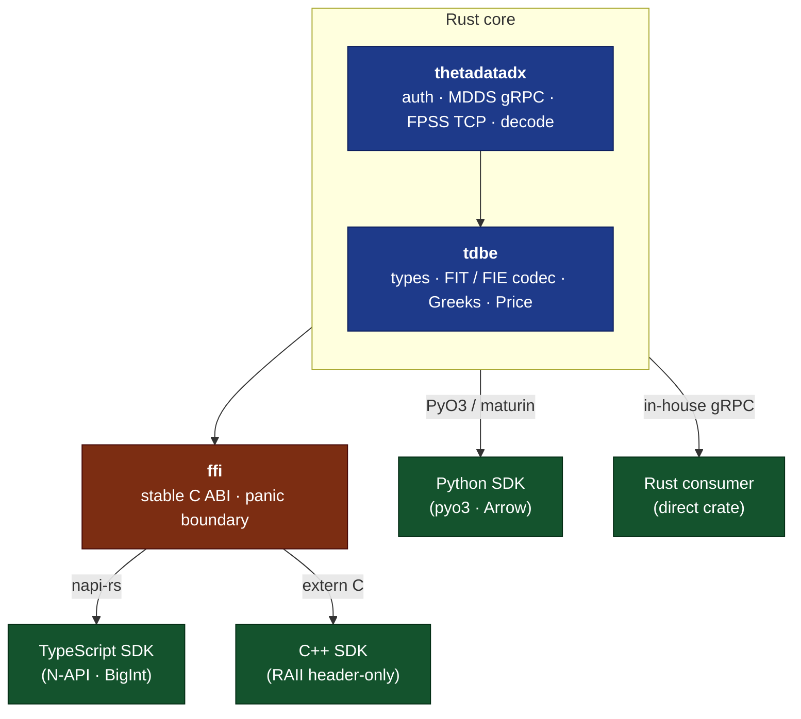

# ThetaDataDx

Rust SDK for ThetaData market data — single Rust core, four language surfaces (Rust, Python, TypeScript, C++).

[](https://github.com/userFRM/ThetaDataDx/actions/workflows/ci.yml)
[](./LICENSE)
[](https://crates.io/crates/thetadatadx)
[](https://pypi.org/project/thetadatadx)
[](https://www.npmjs.com/package/thetadatadx)
[](https://docs.rs/thetadatadx)
[](https://discord.thetadata.us/)

`thetadatadx` is a native Rust SDK for [ThetaData](https://thetadata.us) market data. It connects directly to ThetaData's three public surfaces — MDDS (historical request/response over gRPC), FPSS (real-time streaming over TCP), and FLATFILES (whole-universe daily blobs over the legacy MDDS port) — decodes ticks in-process, and exposes a typed API across Rust, Python, TypeScript, and C++ from a single Rust core. No JVM, no subprocess, no IPC serialization. Third-party C consumers can integrate against the unchanged C ABI in [`ffi/`](ffi/) — header at [`sdks/cpp/include/thetadx.h`](sdks/cpp/include/thetadx.h), all FFI types and free functions exported as `tdx_*` symbols.

> [!IMPORTANT]
> A valid [ThetaData](https://thetadata.us) subscription is required. The SDK authenticates against ThetaData's Nexus API using your account credentials.

## Requirements

- Rust 1.88 or newer. Declared as `rust-version = "1.88"` on every
  workspace `[package]`; the Linux Lint job in CI is pinned to this
  floor so dependency bumps that raise the rustc requirement surface
  before release.
- A valid [ThetaData](https://thetadata.us) subscription for the live
  endpoints.

## Highlights

- **Typed everywhere.** 61 ThetaData endpoints exposed as typed methods across all four SDKs; no raw JSON or protobuf on the public surface.
- **Arrow-backed DataFrames.** Python `to_arrow()` / `to_pandas()` / `to_polars()` pipe through shared Arrow buffers.
- **SPKI-pinned FPSS TLS.** Public-key pinning on the FPSS streaming handshake.
- **FIT decoder + SPSC ring buffer** on the FPSS path. Decode cost is measured in the benchmarks under `crates/thetadatadx/benches/`.
- **Shared FFI layer.** C++ and Node.js go through the same `extern "C"` layer; the Python wheel uses PyO3 ABI3 directly. The C ABI is also the supported integration path for any third-party C / C++ consumer.
- **Covers all three public surfaces.** MDDS gRPC endpoints, FPSS wire format with reconnect semantics, and the FLATFILES daily-blob protocol — every transport speaks directly to ThetaData's production servers from a single client. See the [vendor flat-file reference](https://http-docs.thetadata.us/operations/get-v2-flat-file-getting-started.html).
- **FLATFILES daily blobs.** Pull whole-universe `(sec_type, req_type, date)` blobs over the legacy MDDS port; decode to vendor-byte CSV, JSONL, or a typed `Vec<FlatFileRow>` in memory. Cross-language coverage is tracked under the binding issues; the Rust core is shipped today.

## Quick start

> [!TIP]
> Credentials can be supplied as a `creds.txt` file (email on line 1, password on line 2), inline via `Credentials::new("email", "password")`, or through the `THETADATA_EMAIL` / `THETADATA_PASSWORD` environment variables.

### Rust

```toml
[dependencies]
thetadatadx = "10"
tokio = { version = "1", features = ["rt-multi-thread", "macros"] }
```

```rust
use thetadatadx::{ThetaDataDxClient, Credentials, DirectConfig};

#[tokio::main]
async fn main() -> Result<(), thetadatadx::Error> {
    let creds = Credentials::from_file("creds.txt")?;
    let tdx = ThetaDataDxClient::connect(&creds, DirectConfig::production()).await?;
    let eod = tdx.stock_history_eod("AAPL", "20240101", "20240301").await?;
    for tick in &eod {
        println!("{}: O={} H={} L={} C={} V={}",
            tick.date, tick.open, tick.high, tick.low, tick.close, tick.volume);
    }
    Ok(())
}
```

Opt into chainable DataFrame ergonomics by enabling the `polars` and/or `arrow` features. Both stay out of the default dep graph:

```toml
[dependencies]
thetadatadx = { version = "10", features = ["polars"] }
```

```rust
use thetadatadx::frames::TicksPolarsExt;

let eod = tdx.stock_history_eod("AAPL", "20240101", "20240301").await?;
let df = eod.as_slice().to_polars()?;
```

The `arrow` feature exposes a `TicksArrowExt::to_arrow` that materialises an `arrow_array::RecordBatch` with the same schema the Python `.to_polars()` / `.to_arrow()` terminal produces. `features = ["frames"]` pulls both in.

### Python

```sh
pip install thetadatadx
```

```python
from thetadatadx import Credentials, Config, ThetaDataDxClient

tdx = ThetaDataDxClient(Credentials.from_file("creds.txt"), Config.production())
for tick in tdx.stock_history_eod("AAPL", "20240101", "20240301"):
    print(f"{tick.date}: O={tick.open:.2f} H={tick.high:.2f} "
          f"L={tick.low:.2f} C={tick.close:.2f} V={tick.volume}")
```

### TypeScript / Node.js

```sh
npm install thetadatadx
```

```typescript
import { ThetaDataDxClient } from 'thetadatadx';

const tdx = await ThetaDataDxClient.connectFromFile('creds.txt');
for (const t of tdx.stockHistoryEOD('AAPL', '20240101', '20240301')) {
    console.log(`${t.date}: O=${t.open} H=${t.high} L=${t.low} C=${t.close} V=${t.volume}`);
}
```

### C++

```cpp
#include <thetadx.hpp>
#include <cstdio>

int main() {
    auto creds  = tdx::Credentials::from_file("creds.txt");
    auto config = tdx::Config::production();
    auto client = tdx::Client::connect(creds, config);
    for (const auto& t : client.stock_history_eod("AAPL", "20240101", "20240301")) {
        std::printf("%d: O=%.2f H=%.2f L=%.2f C=%.2f V=%lld\n",
            t.date, t.open, t.high, t.low, t.close, (long long)t.volume);
    }
}
```

## Streaming

One connection, one auth. Historical queries are available immediately; streaming connects lazily on first subscription. The client auto-reconnects and re-subscribes all active contracts on involuntary disconnect.

The primary streaming surface is the **fluent contract-first API** —
`Contract::stock("AAPL").quote()` returns a typed `Subscription` value
that the polymorphic `client.subscribe(...)` accepts directly:

```rust
use thetadatadx::fpss::{FpssData, FpssEvent};
use thetadatadx::prelude::*;

tdx.start_streaming(|event: &FpssEvent| {
    match event {
        FpssEvent::Data(FpssData::Quote { contract, bid, ask, .. }) => {
            println!("Quote: {} bid={bid} ask={ask}", contract.symbol);
        }
        FpssEvent::Data(FpssData::Trade { contract, price, size, .. }) => {
            println!("Trade: {} @ {price} x {size}", contract.symbol);
        }
        _ => {}
    }
})?;

let stock  = Contract::stock("AAPL");
let option = Contract::option("SPY", "20260620", "550", "C")?;

tdx.subscribe(stock.quote())?;
tdx.subscribe(option.trade())?;
tdx.subscribe(SecType::Option.full_open_interest())?;

// Bulk install:
tdx.subscribe_many(vec![stock.quote(), option.quote()])?;
```

All prices (`bid`, `ask`, `price`, `open`, `high`, `low`, `close`) are `f64`, decoded during parsing.

### Choosing buffered vs streaming for historical pulls

Every historical builder (`option_history_*`, `stock_history_*`,
`index_history_*`, `interest_rate_history_*`) supports two terminals:

| Workload | Use |
|---|---|
| Single day / one-shot ad-hoc query | `.await` |
| Single day, deterministic small response | `.await` |
| Bulk / multi-day backfill | `.stream(handler)` |
| Tick-interval responses | `.stream(handler)` |
| Greeks responses across a long horizon | `.stream(handler)` |

Buffered `.await` collects the full response into `Vec<Tick>` before
returning. On a 2.4 M-tick day this consumes ~5 GiB of RSS before any
caller code runs. `.stream(handler)` yields chunks via
`handler(&[Tick])` and drops each chunk before the next is fetched —
peak RSS stays at ~150 MiB regardless of response size.

When the buffered path returns a response whose estimated size exceeds
`MddsConfig::warn_on_buffered_threshold_bytes` (default 100 MiB), the
SDK emits a single `tracing::warn!` event suggesting `.stream(handler)`
for the workload (`endpoint`, `row_count`, `bytes_est` fields). Set the
threshold to `0` to disable. See
[`docs-site/docs/legacy-quote-handling.md`](docs-site/docs/legacy-quote-handling.md)
for the full migration recipe.

## API coverage

61 registry/REST endpoints plus 4 SDK-only historical stream variants, FPSS real-time streaming, and a full Black-Scholes Greeks calculator.

| Category | Endpoints | Examples |
|----------|-----------|----------|
| Stock | 14 | EOD, OHLC, trades, quotes, snapshots, at-time |
| Option | 34 | Same as stock + 5 Greeks tiers, open interest, contracts |
| Index | 9 | EOD, OHLC, price, snapshots |
| Calendar | 3 | Market open/close, holiday schedule |
| Interest Rate | 1 | EOD rate history |

All endpoints return fully typed data in every language. See the [API Reference](docs/api-reference.md) for the complete method list.

**Additional surfaces** (not REST/gRPC endpoints): FPSS real-time streaming (7 subscribe/unsubscribe methods per contract and per full-stream type) and a local Greeks calculator (22 Black-Scholes Greeks plus an IV solver, callable individually or batched).

### Coverage notes

* **2022-era options NBBO quotes (#571)**: the upstream Terminal cascades the h2 stream on pre-extension 6-field NBBO rows that storage surfaces for some 2022 contracts. The SDK ships three independent recovery paths: a REST transport (`crate::rest::RestClient`) with a `FallbackPolicy` enum that routes the four affected endpoints over HTTP/1.1 automatically, a `local-terminal-patcher` CLI that rewrites the local Terminal jar to tolerate the legacy rows on the gRPC path, and a lenient gRPC decoder that picks up the eventual upstream fix without further SDK change. See [`docs-site/docs/legacy-quote-handling.md`](docs-site/docs/legacy-quote-handling.md) for the recipe.

## Architecture



| Layer | Crate / package | Purpose |
|-------|-----------------|---------|
| Encoding / types | [`crates/tdbe`](crates/tdbe/) | Tick structs, FIT/FIE codecs, Greeks, Price |
| Core SDK | [`crates/thetadatadx`](crates/thetadatadx/) | MDDS gRPC client, FPSS streaming, auth |
| C FFI | [`ffi/`](ffi/) | Stable `extern "C"` layer consumed by C++, Node.js, and any third-party C / C++ consumer |
| Python | [`sdks/python`](sdks/python/) | PyO3 / maturin wheel with Arrow DataFrame adapter |
| TypeScript | [`sdks/typescript`](sdks/typescript/) | napi-rs prebuilt binary |
| C++ | [`sdks/cpp`](sdks/cpp/) | RAII header-only wrapper |
| CLI | [`tools/cli`](tools/cli/) | `tdx` CLI — every generated historical endpoint from the command line |
| MCP | [`tools/mcp`](tools/mcp/) | MCP server - gives clients access to every generated historical endpoint plus offline tools over JSON-RPC |
| Server | [`tools/server`](tools/server/) | REST + WebSocket server exposing the `/v3/*` route surface |
| Docs | [`docs/`](docs/) | API reference, architecture, attribution |
| Website | [`docs-site/`](docs-site/) | VitePress documentation site (deployed to GitHub Pages) |
| Notebooks | [`notebooks/`](notebooks/) | 7 Jupyter notebooks (101-107) |

## Documentation

| Document | Description |
|----------|-------------|
| [API Reference](docs/api-reference.md) | All typed methods, streaming builders, generated tick types, and configuration options |
| [Architecture](docs/architecture.md) | System design, wire protocols, TOML codegen pipeline |
| [Endpoint Schema](docs/endpoint-schema.md) | TOML codegen format for adding new types/columns |
| [Proto Maintenance](crates/thetadatadx/proto/MAINTENANCE.md) | Guide for updating proto files |
| [Roadmap](docs/ROADMAP.md) | Per-binding coverage status |
| [Changelog](CHANGELOG.md) | Release notes with breaking changes, features, and fixes |

## Contributing

Contributions are welcome. See [CONTRIBUTING.md](CONTRIBUTING.md) for development setup, pre-commit checks, and pull-request process. Community discussion happens on the [ThetaData Discord](https://discord.thetadata.us/).

## License

Licensed under the Apache License, Version 2.0. See [LICENSE](./LICENSE).
