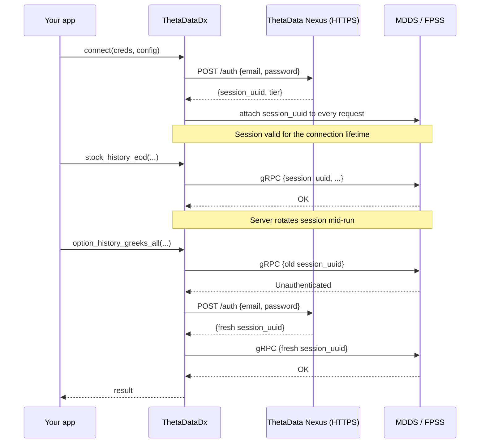

# Authentication

ThetaDataDx authenticates with ThetaData's Nexus endpoint over HTTPS using your account email and password, then attaches the returned session UUID to every subsequent gRPC (MDDS) and FPSS frame. The Java terminal is not in the loop.

## Credentials file

Create a `creds.txt` with email on line 1 and password on line 2:

```text
your-email@example.com
your-password
```

::: warning
Do not commit `creds.txt`. Add it to `.gitignore`.
:::

Load it:

::: code-group
```rust [Rust]
use thetadatadx::Credentials;

let creds = Credentials::from_file("creds.txt")?;
```
```python [Python]
from thetadatadx import Credentials

creds = Credentials.from_file("creds.txt")
```
```typescript [TypeScript]
import { ThetaDataDx } from 'thetadatadx';

const tdx = await ThetaDataDx.connectFromFile('creds.txt');
```
```go [Go]
creds, err := thetadatadx.CredentialsFromFile("creds.txt")
if err != nil { log.Fatal(err) }
defer creds.Close()
```
```cpp [C++]
auto creds = tdx::Credentials::from_file("creds.txt");
```
:::

The file loader reads into a `Zeroizing<String>` buffer so the on-disk password bytes are wiped on drop; a panic between read and struct construction still zeros the plaintext on unwind.

## Environment variables

For containerized deployments or CI pipelines, pass credentials through environment variables instead:

::: code-group
```rust [Rust]
use thetadatadx::Credentials;

let creds = Credentials::new(
    std::env::var("THETA_EMAIL")?,
    std::env::var("THETA_PASS")?,
);
```
```python [Python]
import os
from thetadatadx import Credentials

creds = Credentials(os.environ["THETA_EMAIL"], os.environ["THETA_PASS"])
```
```typescript [TypeScript]
import { ThetaDataDx } from 'thetadatadx';

const tdx = await ThetaDataDx.connect(
    process.env.THETA_EMAIL!,
    process.env.THETA_PASS!,
);
```
```go [Go]
creds, err := thetadatadx.CredentialsFromEnv("THETA_EMAIL", "THETA_PASS")
if err != nil { log.Fatal(err) }
defer creds.Close()
```
```cpp [C++]
auto creds = tdx::Credentials(
    std::getenv("THETA_EMAIL"),
    std::getenv("THETA_PASS")
);
```
:::

::: tip
Environment variables are the recommended approach for production deployments and Docker containers. The file-based approach is the right default for local development.
:::

## Connecting

Once you have credentials, connect to ThetaData's production servers:

::: code-group
```rust [Rust]
use thetadatadx::{ThetaDataDx, Credentials, DirectConfig};

let creds = Credentials::from_file("creds.txt")?;
let tdx = ThetaDataDx::connect(&creds, DirectConfig::production()).await?;
```
```python [Python]
from thetadatadx import Credentials, Config, ThetaDataDx

creds = Credentials.from_file("creds.txt")
tdx = ThetaDataDx(creds, Config.production())
```
```typescript [TypeScript]
import { ThetaDataDx } from 'thetadatadx';

const tdx = await ThetaDataDx.connectFromFile('creds.txt');
```
```go [Go]
creds, _ := thetadatadx.CredentialsFromFile("creds.txt")
defer creds.Close()
config := thetadatadx.ProductionConfig()
defer config.Close()
client, err := thetadatadx.Connect(creds, config)
if err != nil { log.Fatal(err) }
defer client.Close()
```
```cpp [C++]
auto creds = tdx::Credentials::from_file("creds.txt");
auto client = tdx::Client::connect(creds, tdx::Config::production());
```
:::

The client authenticates on connection. Bad credentials return an `AuthError` immediately — no network round-trip to discover them later.

## Token lifecycle



Key facts:

- The session UUID lifetime is server-controlled. The SDK does not refresh proactively; it refreshes on an `Unauthenticated` gRPC status.
- Refresh is one-shot: if the fresh UUID also fails, the error propagates as `AuthError` because the credentials themselves are bad.
- The email and password are never logged. Both the tracing spans and the `Debug` impl for `Credentials` / `AuthResponse` emit `<redacted>` for the email and never render the password.
- Every intermediate buffer that holds the plaintext password is wrapped in `zeroize::Zeroizing` so the bytes are wiped on drop. Panics on unwind still clear the plaintext.

## Next

- [First query](./first-query) — one historical call in every language
- [Error handling](./errors) — `AuthError` subclasses and refresh retry patterns
- [Configuration](../configuration) — `DirectConfig` fields including `nexus_*` timeouts
