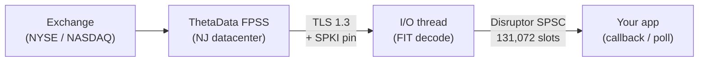

# Streaming (FPSS)

The ThetaData Python SDK has no streaming surface. ThetaDataDx ships a full FPSS (Feed Processing Streaming Server) client: persistent TLS/TCP connection, SPKI certificate pinning, delta-decompressed FIT frames, and a lock-free SPSC ring buffer for event dispatch.

This page covers the streaming model at the Getting Started level. For event shapes, reconnection semantics, latency measurement, and per-SDK method references, see the dedicated [Real-Time Streaming section](../streaming/).

## Architecture



Events are decoded from the FIT wire format and delta-decompressed on a dedicated I/O thread, then dispatched through an LMAX Disruptor SPSC ring buffer to your callback (Rust) or polling queue (Python / TypeScript / Go / C++). Every data event carries a `received_at_ns` nanosecond timestamp captured at frame decode time.

## SPKI pinning

The FPSS client pins the server's SubjectPublicKeyInfo (SPKI) digest on TLS handshake using constant-time comparison. A server presenting a different public key — from a hostile MITM intermediary or an accidentally swapped certificate — fails the handshake before any auth credentials leave the process.

Pins live in `crates/thetadatadx/src/fpss/pinning.rs` and are tested against all four production FPSS hosts. Callers do not need to configure pins; the default `DirectConfig::production()` wires them up.

## Dispatch model

| SDK | Model | Event type | Details |
|-----|-------|------------|---------|
| **Rust** | Synchronous callback | `&FpssEvent` enum | Disruptor ring dispatch. No Tokio on the hot path. |
| **Python** | Polling | typed pyclass | `next_event(timeout_ms=...)` returns typed `Quote` / `Trade` / `Ohlcvc` / `OpenInterest` / `Simple` / `RawData`. |
| **TypeScript** | Polling | JS object | `nextEvent(timeoutMs)` returns JS objects with all fields. |
| **Go** | Polling | `*FpssEvent` struct | `NextEvent(timeoutMs)` returns typed Go structs. Prices pre-decoded to `float64`. |
| **C++** | Polling | `FpssEventPtr` | `next_event(timeout_ms)` returns `std::unique_ptr<TdxFpssEvent>`. `#[repr(C)]` layout. |

Under the hood every SDK reads from the same SPSC ring; polling SDKs consume with a timeout, and the Rust callback is driven by a ring-reader thread.

## Ring buffer

- Backing type: LMAX Disruptor SPSC with a power-of-two slot count.
- Default: **131,072 slots**. Caller-configurable at `FpssClient::connect`.
- Behavior on overflow: tail-drop with a `ServerError` control event so the consumer sees explicit backpressure.

## Reconnect policy

`ReconnectPolicy` is an enum with three variants:

| Variant | Behavior |
|---------|----------|
| `Auto` (default) | 2 s delay on most transient reasons; 130 s delay after `TooManyRequests` (code 12). Gives up after 5 consecutive `Disconnected(permanent)` frames (bad credentials). |
| `Never` | No automatic retry; emit `Disconnected` event and let the caller handle it. |
| `Custom(fn)` | User closure `fn(reason, attempt) -> Option<Duration>` — return `None` to stop retrying, or a delay to wait before the next attempt. Enables jittered exponential backoff, per-hour budget caps, whatever policy fits the caller's failure model. |

## Minimal example

::: code-group
```rust [Rust]
use thetadatadx::{ThetaDataDx, Credentials, DirectConfig};
use thetadatadx::fpss::{FpssData, FpssEvent};
use thetadatadx::fpss::protocol::Contract;

#[tokio::main]
async fn main() -> Result<(), thetadatadx::Error> {
    let creds = Credentials::from_file("creds.txt")?;
    let tdx = ThetaDataDx::connect(&creds, DirectConfig::production()).await?;

    tdx.start_streaming(|event: &FpssEvent| match event {
        FpssEvent::Data(FpssData::Quote { contract, bid, ask, .. }) => {
            println!("Quote: {} {bid:.2}/{ask:.2}", contract.root);
        }
        FpssEvent::Data(FpssData::Trade { contract, price, size, .. }) => {
            println!("Trade: {} {price:.2} x {size}", contract.root);
        }
        _ => {}
    })?;

    tdx.subscribe_quotes(&Contract::stock("AAPL"))?;
    tdx.subscribe_trades(&Contract::stock("MSFT"))?;

    std::thread::park();
    tdx.stop_streaming();
    Ok(())
}
```
```python [Python]
from thetadatadx import Credentials, Config, ThetaDataDx

creds = Credentials.from_file("creds.txt")
tdx = ThetaDataDx(creds, Config.production())
tdx.start_streaming()
tdx.subscribe_quotes("AAPL")
tdx.subscribe_trades("MSFT")

while True:
    event = tdx.next_event(timeout_ms=5000)
    if event is None:
        continue
    if event.kind == "quote":
        print(f"Quote: {event.contract_id} {event.bid:.2f}/{event.ask:.2f}")
    elif event.kind == "trade":
        print(f"Trade: {event.contract_id} {event.price:.2f} x {event.size}")
```
:::

## Next

- [Connecting & subscribing](../streaming/connection) — server selection, flush mode, queue depth
- [Handling events](../streaming/events) — every event type with full field tables
- [Reconnection](../streaming/reconnection) — `reconnect()` / `reconnect_streaming()` APIs
- [Latency measurement](../streaming/latency) — `received_at_ns` and `tdbe::latency::latency_ns()`
