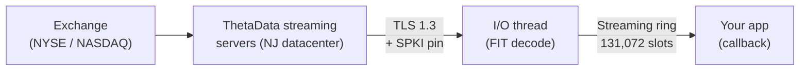

# Streaming

ThetaDataDx ships a real-time streaming client: persistent TLS/TCP connection, SPKI certificate pinning, delta-decompressed FIT frames, and an SPSC ring buffer for event dispatch.

This page covers the streaming model at the Getting Started level. For event shapes, reconnection semantics, latency measurement, and per-SDK method references, see the dedicated [Real-Time Streaming section](../streaming/).

## Architecture



Events are decoded from the FIT wire format and delta-decompressed on a dedicated I/O thread, then dispatched through a single-producer single-consumer ring buffer to your callback. Every data event carries a `received_at_ns` nanosecond timestamp captured at frame decode time.

## SPKI pinning

The streaming client pins the server's SubjectPublicKeyInfo (SPKI) digest on TLS handshake using constant-time comparison. A server presenting a different public key — from a hostile MITM intermediary or an accidentally swapped certificate — fails the handshake before any auth credentials leave the process.

Pins are tested against all four production streaming hosts. Callers do not need to configure them; the default `DirectConfig::production()` wires them up.

## Dispatch model

| SDK | Push (callback) | Event shape | Details |
|-----|-----------------|-------------|---------|
| **Rust** | `client.start_streaming(\|event\| ...)` | `&FpssEvent` enum | Ring-buffer dispatch. No Tokio on the hot path. |
| **Python** | `client.start_streaming(callback)` | typed pyclass per `FpssData` / `FpssControl` variant | Dispatcher thread invokes the callable under the GIL, wrapped in `catch_unwind`. |
| **TypeScript** | `client.startStreaming(callback)` | JS object discriminated on `event.kind` | napi-rs `ThreadsafeFunction` routes events onto the Node main thread; the TLS reader never touches V8. |
| **C++** | `client.set_callback(lambda)` | `TdxFpssEvent` | `#[repr(C)]` tagged union; direct struct-member access, no JSON. |

The streaming ring sits between the TLS reader and the consumer that runs the user callback, so a slow callback at most fills the ring and bumps `dropped_event_count()` — it cannot back-pressure the reader and trigger a vendor-side disconnect.

## Ring buffer

- Backing type: SPSC ring buffer with a power-of-two slot count.
- Default: **131,072 slots**. Caller-configurable at `FpssClient::connect`.
- Behavior on overflow: tail-drop with a `ServerError` control event so the consumer sees explicit backpressure.

## Reconnect policy

`ReconnectPolicy` is an enum with three variants:

| Variant | Behavior |
|---------|----------|
| `Auto` (default) | 2 s delay on most transient reasons; 130 s delay after `TooManyRequests` (code 12). Gives up after 5 consecutive `Disconnected(permanent)` frames (bad credentials). |
| `Never` | No automatic retry; emit `Disconnected` event and let the caller handle it. |
| `Custom(fn)` | User closure `fn(reason, attempt) -> Option<Duration>` — return `None` to stop retrying, or a delay to wait before the next attempt. Enables jittered exponential backoff, per-hour budget caps, whatever policy fits the caller's failure model. |

## Minimal example

::: code-group
```rust [Rust]
use thetadatadx::{ThetaDataDxClient, Credentials, DirectConfig};
use thetadatadx::fpss::{FpssData, FpssEvent};
use thetadatadx::fpss::protocol::Contract;

#[tokio::main]
async fn main() -> Result<(), thetadatadx::Error> {
    let creds = Credentials::from_file("creds.txt")?;
    let client = ThetaDataDxClient::connect(&creds, DirectConfig::production()).await?;

    client.start_streaming(|event: &FpssEvent| match event {
        FpssEvent::Data(FpssData::Quote { contract, bid, ask, .. }) => {
            println!("Quote: {} {bid:.2}/{ask:.2}", contract.symbol);
        }
        FpssEvent::Data(FpssData::Trade { contract, price, size, .. }) => {
            println!("Trade: {} {price:.2} x {size}", contract.symbol);
        }
        _ => {}
    })?;

    client.subscribe(Contract::stock("AAPL").quote())?;
    client.subscribe(Contract::stock("MSFT").trade())?;

    std::thread::park();
    client.stop_streaming();
    Ok(())
}
```
```python [Python]
from thetadatadx import Credentials, Config, ThetaDataDxClient, Contract

creds = Credentials.from_file("creds.txt")
client = ThetaDataDxClient(creds, Config.production())

def on_event(event):
    if event.kind == "quote":
        print(f"Quote: {event.contract.symbol} {event.bid:.2f}/{event.ask:.2f}")
    elif event.kind == "trade":
        print(f"Trade: {event.contract.symbol} {event.price:.2f} x {event.size}")

# `streaming(callback)` is a context manager that registers
# `on_event` on enter and pairs `stop_streaming()` + `await_drain()`
# on exit.
with client.streaming(on_event):
    client.subscribe(Contract.stock("AAPL").quote())
    client.subscribe(Contract.stock("MSFT").trade())
    import time
    time.sleep(60)
```
:::

## Next

- [Connecting & subscribing](../streaming/connection) — server selection, flush mode, queue depth
- [Handling events](../streaming/events) — every event type with full field tables
- [Reconnection](../streaming/reconnection) — `reconnect()` / `reconnect_streaming()` APIs
- [Latency measurement](../streaming/latency) — `received_at_ns` and `tdbe::latency::latency_ns()`
