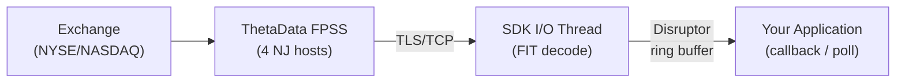

# Real-Time Streaming

Real-time market data is delivered via ThetaData's FPSS (Feed Processing Streaming Server) over persistent TLS/TCP connections. FPSS delivers live quotes, trades, open interest, and OHLCVC bars as typed, zero-copy events.

## Architecture



Events are decoded from the FIT wire format and delta-decompressed on an I/O thread, then dispatched through an LMAX Disruptor ring buffer to your callback (Rust) or polling queue (Python/TypeScript/Go/C++). Every data event carries a `received_at_ns` nanosecond timestamp captured at frame decode time.

## Client Model

Streaming is delivered through a **different client surface in each SDK**, by design:

| SDK | Streaming client | Notes |
|-----|------------------|-------|
| **Rust** | `ThetaDataDx` (the main client) | `start_streaming(callback)`, `subscribe_*`, `stop_streaming` are methods on the unified client. The streaming connection is established lazily. |
| **Python** | `ThetaDataDx` (the main client) | Same unified client. Call `start_streaming()`, then poll `next_event()`. |
| **TypeScript/Node.js** | `ThetaDataDx` (the main client) | Same unified client. Call `startStreaming()`, then poll `nextEvent()`. |
| **Go** | **`FpssClient`** (separate type) | The Go `Client` is historical-only. Construct a standalone `thetadatadx.NewFpssClient(creds, config)` for streaming. |
| **C++** | **`tdx::FpssClient`** (separate type) | The C++ `tdx::Client` is historical-only. Construct a standalone `tdx::FpssClient(creds, config)` for streaming. |

This is not a drift or API mismatch -- it is the intentional per-language surface. Rust and Python can afford a unified client because both compile or bind against the same Rust core. Go and C++ use a thin FFI and split the surface to keep each handle's lifetime and memory ownership unambiguous.

::: tip
If you are porting code between SDKs: anywhere a Rust, Python, or TypeScript example calls `tdx.subscribe_quotes(...)` / `tdx.subscribeQuotes(...)` on the main client, the Go and C++ equivalents call `fpss.SubscribeQuotes(...)` / `fpss.subscribe_quotes(...)` on a separate `FpssClient` handle.
:::

## SDK Streaming Models

| SDK | Model | Event Type | Details |
|-----|-------|------------|---------|
| **Rust** | Synchronous callback | `&FpssEvent` enum | Disruptor ring buffer dispatch. No Tokio on the hot path. |
| **Python** | Polling | typed pyclass | `next_event()` returns typed `Quote` / `Trade` / `Ohlcvc` / `OpenInterest` / `Simple` / `RawData` objects. |
| **TypeScript/Node.js** | Polling | `object` | `nextEvent()` returns events as JS objects with all fields. |
| **Go** | Polling | `*FpssEvent` struct | `NextEvent()` returns typed Go structs. Price fields pre-decoded to `float64`. |
| **C++** | Polling | `FpssEventPtr` | `next_event()` returns `unique_ptr<TdxFpssEvent>` (RAII). `#[repr(C)]` layout. |

::: warning No JSON in FFI
Go and C++ receive typed `#[repr(C)]` structs directly from Rust -- not JSON. All field access is zero-copy struct member access.
:::

## Available Data Streams

| Stream | Event Type | Description |
|--------|------------|-------------|
| Quotes | `Quote` | Real-time NBBO bid/ask updates (11 fields + `received_at_ns`) |
| Trades | `Trade` | Individual trade executions (16 fields + `received_at_ns`) |
| Open Interest | `OpenInterest` | Current open interest for options (3 fields + `received_at_ns`) |
| OHLCVC | `Ohlcvc` | Aggregated OHLC bars with volume (`i64`) and count (`i64`) |
| Full Trades | `Trade` | All trades for an entire security type (firehose) |
| Full OI | `OpenInterest` | All open interest for an entire security type (firehose) |

## Event Categories

Events are either **data** (market ticks) or **control** (lifecycle/protocol):

- **Data events**: `Quote`, `Trade`, `OpenInterest`, `Ohlcvc` -- every one carries `received_at_ns`
- **Control events**: `LoginSuccess`, `ContractAssigned`, `ReqResponse`, `MarketOpen`, `MarketClose`, `ServerError`, `Disconnected`, `Error`
- **RawData**: undecoded fallback for corrupt or unrecognized frames

## Flush Mode

`FpssFlushMode` controls when the TCP write buffer is flushed:

| Mode | Behavior | Latency | Syscall overhead |
|------|----------|---------|-----------------|
| `Batched` (default) | Flush only on PING frames (~100ms) | Up to 100ms additional | Lower |
| `Immediate` | Flush after every frame write | Lowest possible | Higher |

## Quick Start

::: code-group
```rust [Rust]
use thetadatadx::{ThetaDataDx, Credentials, DirectConfig};
use thetadatadx::fpss::{FpssData, FpssControl, FpssEvent};
use thetadatadx::fpss::protocol::Contract;


#[tokio::main]
async fn main() -> Result<(), thetadatadx::Error> {
let creds = Credentials::from_file("creds.txt")?;
let tdx = ThetaDataDx::connect(&creds, DirectConfig::production()).await?;

tdx.start_streaming(|event: &FpssEvent| {
    match event {
        FpssEvent::Data(FpssData::Quote { contract_id, bid, ask, .. }) => {
            println!("Quote: contract={contract_id} bid={bid:.2} ask={ask:.2}");
        }
        FpssEvent::Data(FpssData::Trade { contract_id, price, size, .. }) => {
            println!("Trade: contract={contract_id} price={price:.2} size={size}");
        }
        _ => {}
    }
})?;

tdx.subscribe_quotes(&Contract::stock("AAPL"))?;
tdx.subscribe_trades(&Contract::stock("MSFT"))?;

std::thread::park(); // block until interrupted
tdx.stop_streaming();
    Ok(())
}
```
```python [Python]
from thetadatadx import Credentials, Config, ThetaDataDx

creds = Credentials.from_file("creds.txt")
tdx = ThetaDataDx(creds, Config.production())
tdx.start_streaming()

tdx.subscribe_quotes("AAPL")
tdx.subscribe_trades("MSFT")

while True:
    event = tdx.next_event(timeout_ms=5000)
    if event is None:
        continue
    if event.kind == "quote":
        print(f"Quote: contract={event.contract_id} "
              f"bid={event.bid:.2f} ask={event.ask:.2f}")
    elif event.kind == "trade":
        print(f"Trade: contract={event.contract_id} "
              f"price={event.price:.2f} size={event.size}")
    elif event.kind == "simple" and event.event_type == "disconnected":
        break

tdx.stop_streaming()
```
```go [Go]
package main

import (
    "fmt"
    "log"

    thetadatadx "github.com/userFRM/thetadatadx/sdks/go"
)

func main() {
    creds, _ := thetadatadx.CredentialsFromFile("creds.txt")
    defer creds.Close()

    config := thetadatadx.ProductionConfig()
    defer config.Close()

    fpss, _ := thetadatadx.NewFpssClient(creds, config)
    defer fpss.Close()

    fpss.SubscribeQuotes("AAPL")
    fpss.SubscribeTrades("MSFT")

    for {
        event, err := fpss.NextEvent(5000)
        if err != nil {
            log.Println("Error:", err)
            break
        }
        if event == nil {
            continue
        }
        switch event.Kind {
        case thetadatadx.FpssQuoteEvent:
            q := event.Quote
            fmt.Printf("Quote: contract=%d bid=%.2f ask=%.2f\n",
                q.ContractID, q.Bid, q.Ask)
        case thetadatadx.FpssTradeEvent:
            t := event.Trade
            fmt.Printf("Trade: contract=%d price=%.2f size=%d\n",
                t.ContractID, t.Price, t.Size)
        }
    }

    fpss.Shutdown()
}
```
```cpp [C++]
#include "thetadx.hpp"
#include <iostream>

int main() {
    auto creds = tdx::Credentials::from_file("creds.txt");
    auto config = tdx::Config::production();
    tdx::FpssClient fpss(creds, config);

    fpss.subscribe_quotes("AAPL");
    fpss.subscribe_trades("MSFT");

    while (true) {
        auto event = fpss.next_event(5000);
        if (!event) continue;

        switch (event->kind) {
        case TDX_FPSS_QUOTE: {
            auto& q = event->quote;
            
            
            std::cout << "Quote: contract=" << q.contract_id
                      << " bid=" << q.bid << " ask=" << q.ask << std::endl;
            break;
        }
        case TDX_FPSS_TRADE: {
            auto& t = event->trade;
            
            std::cout << "Trade: contract=" << t.contract_id
                      << " price=" << t.price << " size=" << t.size << std::endl;
            break;
        }
        default: break;
        }
    }

    fpss.shutdown();
}
```
:::

## Server Environments

| Config | FPSS Ports | Purpose |
|--------|-----------|---------|
| `DirectConfig::production()` | 20000, 20001 | Live production data |
| `DirectConfig::dev()` | 20200, 20201 | Historical day replay at max speed (markets closed testing) |
| `DirectConfig::stage()` | 20100, 20101 | Staging/testing (frequent reboots, unstable) |

FPSS hosts are configurable -- not hardcoded. Override `fpss_hosts` on `DirectConfig` or use a TOML config file.

## Next Steps

1. [Connecting & Subscribing](./connection) -- establish a streaming connection, choose server environment, configure flush mode
2. [Handling Events](./events) -- process data and control events with full field reference tables
3. [Latency Measurement](./latency) -- use `received_at_ns` and `tdbe::latency::latency_ns()` for wire-to-application latency
4. [Reconnection & Error Handling](./reconnection) -- handle disconnects with `reconnect_streaming()` or manual recovery
