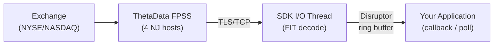

# Real-Time Streaming

Real-time market data is delivered via ThetaData's FPSS (Feed Processing Streaming Server) over persistent TLS/TCP connections. FPSS delivers live quotes, trades, open interest, and OHLCVC bars as typed, zero-copy events.

## Architecture

Events are decoded from the FIT wire format and delta-decompressed on an I/O thread, then dispatched through an LMAX Disruptor ring buffer to your callback (Rust) or polling queue (Python/Go/C++). Every data event carries a `received_at_ns` nanosecond timestamp captured at frame decode time.

## SDK Streaming Models

| SDK | Model | Event Type | Details |
|-----|-------|------------|---------|
| **Rust** | Synchronous callback | `&FpssEvent` enum | Disruptor ring buffer dispatch. No Tokio on the hot path. |
| **Python** | Polling | `dict` | `next_event()` returns events as Python dicts with all fields. |
| **Go** | Polling | `*FpssEvent` struct | `NextEvent()` returns typed Go structs. Price fields pre-decoded to `float64`. |
| **C++** | Polling | `FpssEventPtr` | `next_event()` returns `unique_ptr<TdxFpssEvent>` (RAII). `#[repr(C)]` layout. |

::: warning No JSON in FFI
Go and C++ receive typed `#[repr(C)]` structs directly from Rust -- not JSON. All field access is zero-copy struct member access.
:::

## Available Data Streams

| Stream | Event Type | Description |
|--------|------------|-------------|
| Quotes | `Quote` | Real-time NBBO bid/ask updates (11 fields + `received_at_ns`) |
| Trades | `Trade` | Individual trade executions (16 fields + `received_at_ns`) |
| Open Interest | `OpenInterest` | Current open interest for options (3 fields + `received_at_ns`) |
| OHLCVC | `Ohlcvc` | Aggregated OHLC bars with volume (`i64`) and count (`i64`) |
| Full Trades | `Trade` | All trades for an entire security type (firehose) |
| Full OI | `OpenInterest` | All open interest for an entire security type (firehose) |

## Event Categories

Events are either **data** (market ticks) or **control** (lifecycle/protocol):

- **Data events**: `Quote`, `Trade`, `OpenInterest`, `Ohlcvc` -- every one carries `received_at_ns`
- **Control events**: `LoginSuccess`, `ContractAssigned`, `ReqResponse`, `MarketOpen`, `MarketClose`, `ServerError`, `Disconnected`, `Error`
- **RawData**: undecoded fallback for corrupt or unrecognized frames

## Flush Mode

`FpssFlushMode` controls when the TCP write buffer is flushed:

| Mode | Behavior | Latency | Syscall overhead |
|------|----------|---------|-----------------|
| `Batched` (default) | Flush only on PING frames (~100ms) | Up to 100ms additional | Lower |
| `Immediate` | Flush after every frame write | Lowest possible | Higher |

## Server Environments

| Config | FPSS Ports | Purpose |
|--------|-----------|---------|
| `DirectConfig::production()` | 20000, 20001 | Live production data |
| `DirectConfig::dev()` | 20200, 20201 | Historical day replay at max speed (markets closed testing) |
| `DirectConfig::stage()` | 20100, 20101 | Staging/testing (frequent reboots, unstable) |

FPSS hosts are configurable -- not hardcoded. Override `fpss_hosts` on `DirectConfig` or use a TOML config file.

## Next Steps

1. [Connecting & Subscribing](./connection) -- establish a streaming connection, choose server environment, configure flush mode
2. [Handling Events](./events) -- process data and control events with full field reference tables
3. [Latency Measurement](./latency) -- use `received_at_ns` and `tdbe::latency::latency_ns()` for wire-to-application latency
4. [Reconnection & Error Handling](./reconnection) -- handle disconnects with `reconnect_streaming()` or manual recovery
