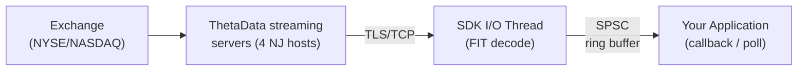

# Real-Time Streaming

Real-time market data is delivered over a persistent TLS/TCP streaming channel into the SDK. The streaming channel carries live quotes, trades, open interest, and OHLCVC bars as typed, zero-copy events.

## Architecture



Events are decoded from the FIT wire format and delta-decompressed on an I/O thread, then dispatched through a ring buffer to your callback (Rust) or polling queue (Python/TypeScript/C++). Every data event carries a `received_at_ns` nanosecond timestamp captured at frame decode time.

## Client Model

Streaming is delivered through a **different client surface in each SDK**, by design:

| SDK | Streaming client | Notes |
|-----|------------------|-------|
| **Rust** | `ThetaDataDxClient` (the main client) | `start_streaming(callback)`, `subscribe(...)`, `stop_streaming` are methods on the unified client. The streaming connection is established lazily. |
| **Python** | `ThetaDataDxClient` (the main client) | Same unified client. Pick push (`start_streaming(callback)`) or pull (`with client.streaming_iter() as it:`). |
| **TypeScript/Node.js** | `ThetaDataDxClient` (the main client) | Same unified client. Pick push (`startStreaming(callback)`) or pull (`for await (const event of client.startStreamingIter())`). |
| **C++** | `tdx::UnifiedClient` (the main client) | Same unified client surface. Push (`start_streaming(lambda)`) and pull (`auto iter = client.start_streaming_iter();`) are both available. |

The unified `ThetaDataDxClient` surface is identical across every binding: one connect call, one `subscribe()` polymorphic over typed subscription specs, two equivalent delivery modes (push callback OR pull iterator) backed by the same SPSC ring on the Rust side.

::: tip
If you are porting code between SDKs: anywhere a Rust example calls `client.subscribe(Contract::stock("AAPL").quote())`, the Python / TypeScript / C++ equivalents call the same polymorphic `subscribe(...)` on the same client type with the same typed subscription spec.
:::

## SDK Streaming Models

| SDK | Push (callback) | Pull (iterator) | Event shape |
|-----|-----------------|-----------------|-------------|
| **Rust** | `client.start_streaming(\|event\| ...)` | `let iter = client.start_streaming_iter()?;` then `for event in iter { ... }` | `&FpssEvent` enum |
| **Python** | `client.start_streaming(callback)` | `with client.streaming_iter() as it: for event in it:` | typed pyclass — iterator raises `StopIteration` once the queue drains on a stopped session |
| **TypeScript/Node.js** | `client.startStreaming(callback)` | `for await (const event of client.startStreamingIter())` | JS object — async iterable resolves `done: true` on terminal end-of-stream |
| **C++** | `client.start_streaming(lambda)` | `client.start_streaming_iter().next(timeout)` | `TdxFpssEvent` — `next(timeout)` returns `std::optional<TdxFpssEvent>`; `ended()` flips on terminal close |

::: warning No JSON in FFI
C++ receives typed `#[repr(C)]` structs directly from Rust -- not JSON. All field access is zero-copy struct member access.
:::

## Available Data Streams

| Stream | Event Type | Description |
|--------|------------|-------------|
| Quotes | `Quote` | Real-time NBBO bid/ask updates (11 fields + `received_at_ns`) |
| Trades | `Trade` | Individual trade executions (16 fields + `received_at_ns`) |
| Open Interest | `OpenInterest` | Current open interest for options (3 fields + `received_at_ns`) |
| OHLCVC | `Ohlcvc` | Aggregated OHLC bars with volume (`i64`) and count (`i64`) |
| Full Trades | `Trade` | All trades for an entire security type (full-stream subscription) |
| Full OI | `OpenInterest` | All open interest for an entire security type (full-stream subscription) |

::: tip Full-stream subscriptions are Stock and Option only
The full-stream subscription (`full_trades` / `full_open_interest`) is broadcast for the Stock and Option security types only. Indices and rates have no full-stream broadcast upstream — subscribe to them per-contract instead, e.g. `Contract::index("VIX").trade()`. A full-stream subscription on any other security type is rejected with a configuration error when you call `subscribe`.
:::

## Event Categories

Events are either **data** (market ticks) or **control** (lifecycle/protocol):

- **Data events**: `Quote`, `Trade`, `OpenInterest`, `Ohlcvc` -- every one carries `received_at_ns`
- **Control events**: `LoginSuccess`, `ContractAssigned`, `ReqResponse`, `MarketOpen`, `MarketClose`, `ServerError`, `Disconnected`, `Error`
- **UnknownFrame**: typed control variant the SDK emits for any frame whose wire code is not yet recognised; carries the raw `code: u8` and `payload: Vec<u8>` for diagnostic logging.

## Flush Mode

`FpssFlushMode` controls when the TCP write buffer is flushed:

| Mode | Behavior | Latency | Syscall overhead |
|------|----------|---------|-----------------|
| `Batched` (default) | Flush only on PING frames (~100ms) | Up to 100ms additional | Lower |
| `Immediate` | Flush after every frame write | Lowest possible | Higher |

## Quick Start

::: code-group
```rust [Rust]
use thetadatadx::{ThetaDataDxClient, Credentials, DirectConfig};
use thetadatadx::fpss::{FpssData, FpssControl, FpssEvent};
use thetadatadx::fpss::protocol::Contract;


#[tokio::main]
async fn main() -> Result<(), thetadatadx::Error> {
    let creds = Credentials::from_file("creds.txt")?;
    let client = ThetaDataDxClient::connect(&creds, DirectConfig::production()).await?;

    client.start_streaming(|event: &FpssEvent| {
        match event {
            FpssEvent::Data(FpssData::Quote { contract, bid, ask, .. }) => {
                println!("Quote: {} bid={bid:.2} ask={ask:.2}", contract.symbol);
            }
            FpssEvent::Data(FpssData::Trade { contract, price, size, .. }) => {
                println!("Trade: {} price={price:.2} size={size}", contract.symbol);
            }
            _ => {}
        }
    })?;

    client.subscribe(Contract::stock("AAPL").quote())?;
    client.subscribe(Contract::stock("MSFT").trade())?;

    std::thread::park(); // block until interrupted
    client.stop_streaming();
    Ok(())
}
```
```python [Python]
from thetadatadx import Credentials, Config, ThetaDataDxClient, Contract

creds = Credentials.from_file("creds.txt")
client = ThetaDataDxClient(creds, Config.production())

client.subscribe(Contract.stock("AAPL").quote())
client.subscribe(Contract.stock("MSFT").trade())

# Pull-iter mode: context-managed typed iterator over the SPSC
# queue. The iterator raises StopIteration once `stop_streaming()`
# fires AND the queue is fully drained; the `with` block pairs
# `stop_streaming()` + `await_drain()` automatically on exit.
with client.streaming_iter() as it:
    for event in it:
        if event.kind == "quote":
            print(f"Quote: {event.contract.symbol} "
                  f"bid={event.bid:.2f} ask={event.ask:.2f}")
        elif event.kind == "trade":
            print(f"Trade: {event.contract.symbol} "
                  f"price={event.price:.2f} size={event.size}")
        elif event.kind == "disconnected":
            break
```
```cpp [C++]
#include "thetadx.hpp"
#include <iostream>

int main() {
    auto creds = tdx::Credentials::from_file("creds.txt");
    auto config = tdx::Config::production();
    auto client = tdx::UnifiedClient::connect(creds, config);

    client.subscribe(tdx::Contract::stock("AAPL").quote());
    client.subscribe(tdx::Contract::stock("MSFT").trade());

    auto iter = client.start_streaming_iter();
    while (!iter.ended()) {
        auto event = iter.next(std::chrono::milliseconds(5000));
        if (!event) continue;

        switch (event->kind) {
        case TDX_FPSS_QUOTE: {
            auto& q = event->quote;
            std::cout << "Quote: " << q.contract.symbol
                      << " bid=" << q.bid << " ask=" << q.ask << std::endl;
            break;
        }
        case TDX_FPSS_TRADE: {
            auto& t = event->trade;
            std::cout << "Trade: " << t.contract.symbol
                      << " price=" << t.price << " size=" << t.size << std::endl;
            break;
        }
        default: break;
        }
    }

    client.stop_streaming();
}
```
:::

## Server Environments

| Config | Streaming Ports | Purpose |
|--------|-----------|---------|
| `DirectConfig::production()` | 20000, 20001 | Live production data |
| `DirectConfig::dev()` | 20200, 20201 | Historical day replay at max speed (markets closed testing) |
| `DirectConfig::stage()` | 20100, 20101 | Staging/testing (frequent reboots, unstable) |

Streaming hosts are configurable -- not hardcoded. Override `fpss_hosts` on `DirectConfig` or use a TOML config file.

## Next Steps

1. [Connecting & Subscribing](./connection) -- establish a streaming connection, choose server environment, configure flush mode
2. [Handling Events](./events) -- process data and control events with full field reference tables
3. [Latency Measurement](./latency) -- use `received_at_ns` and `tdbe::latency::latency_ns()` for wire-to-application latency
4. [Reconnection & Error Handling](./reconnection) -- handle disconnects with `reconnect_streaming()` or manual recovery
