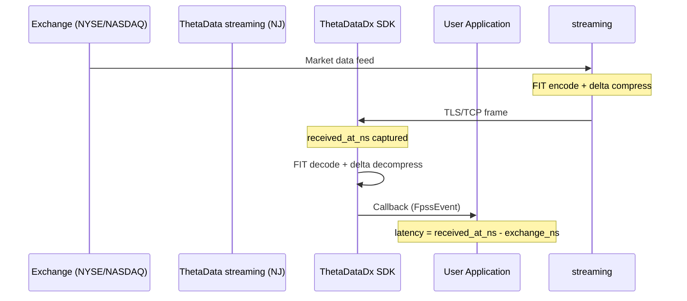
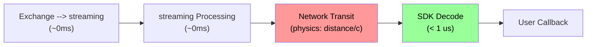

# Latency Measurement

Every streaming data event carries a `received_at_ns` field -- the wall-clock nanosecond timestamp captured the instant the frame is decoded in the I/O thread, before it enters the ring buffer buffer or reaches your callback.

Combined with the exchange's `ms_of_day` timestamp on each tick, this gives you wire-to-application latency per event.

## How it works



The exchange stamps each quote/trade with `ms_of_day` (milliseconds since midnight ET). Your application stamps `received_at_ns` (nanoseconds since UNIX epoch). The difference is your total latency: exchange -> ThetaData -> network -> TLS -> decode -> your callback.



The network transit segment (red) dominates total latency. The SDK decode time (green) is sub-microsecond and negligible.

::: danger Production only
Latency can only be measured meaningfully on the **production** streaming server (`DirectConfig::production()`, port 20000) **during live trading sessions** (pre-market 4:00 AM, regular 9:30 AM - 4:00 PM, after-hours until 8:00 PM ET). The dev server (port 20200) replays historical data from a past trading day at maximum speed -- the exchange timestamps are from the past, so `received_at_ns` minus the event's original timestamp produces values that are months or years, not real latency. The dev server is for functional testing only, not latency benchmarking.
:::

## `tdbe::latency::latency_ns()`

The `tdbe` crate provides a DST-aware helper that converts the exchange `ms_of_day` + `date` into epoch nanoseconds and computes the delta:

```rust
pub fn latency_ns(exchange_ms_of_day: i32, event_date: i32, received_at_ns: u64) -> i64
```

**Parameters:**
- `exchange_ms_of_day`: from the tick (e.g., `34200000` = 9:30 AM ET)
- `event_date`: YYYYMMDD from the tick (e.g., `20260402`)
- `received_at_ns`: from `FpssData.received_at_ns`

**Returns:** Latency in nanoseconds. DST-aware (handles EST/EDT transitions automatically). Returns negative values if your clock is behind the exchange (clock skew).

## Measuring Latency

::: code-group
```rust [Rust]
use thetadatadx::fpss::{FpssEvent, FpssData};
use tdbe::latency::latency_ns;

tdx.start_streaming(|event: &FpssEvent| {
    match event {
        FpssEvent::Data(FpssData::Quote {
            ms_of_day, date, received_at_ns, bid, ask, ..
        }) => {
            let lat_ns = latency_ns(*ms_of_day, *date, *received_at_ns);
            let lat_ms = lat_ns as f64 / 1_000_000.0;
            println!("SPY {bid:.2}/{ask:.2}  latency: {lat_ms:.1}ms");
        }
        FpssEvent::Data(FpssData::Trade {
            ms_of_day, date, received_at_ns, price, size, ..
        }) => {
            let lat_ns = latency_ns(*ms_of_day, *date, *received_at_ns);
            let lat_us = lat_ns as f64 / 1_000.0;
            println!("TRADE {price:.2} x{size}  latency: {lat_us:.0}us");
        }
        _ => {}
    }
})?;
```
```python [Python]
import time
from thetadatadx import ThetaDataDxClient, Credentials, Config, Contract

client = ThetaDataDxClient(Credentials.from_file("creds.txt"), Config.production())

def on_event(event):
    if event.kind == "quote":
        received_ns = event.received_at_ns
        # received_at_ns is the Rust-side receive time.
        # The delta to time.time_ns() measures Rust-to-Python bridging
        # overhead (typically <1ms). True wire latency is best computed
        # on the Rust side using tdbe::latency::latency_ns().
        now_ns = time.time_ns()
        approx_latency_ms = (now_ns - received_ns) / 1_000_000
        print(f"{event.contract.symbol} {event.bid:.2f}/{event.ask:.2f}  "
              f"received_at_ns={received_ns}  "
              f"since_receive={approx_latency_ms:.1f}ms")

client.start_streaming(on_event)
client.subscribe(Contract.stock("SPY").quote())
```
```cpp [C++]
client.set_callback([](const tdx::FpssEvent& event) {
    if (event.kind == TDX_FPSS_QUOTE) {
        auto& q = event.quote;
        // bid and ask are already decoded to double (f64).
        // received_at_ns is captured at frame decode time on the Rust side.
        std::cout << "Quote: bid=" << q.bid << " ask=" << q.ask
                  << " rx=" << q.received_at_ns << "ns" << std::endl;
    }
});
```
:::

## Lowest Latency Configuration

For the absolute lowest latency:

1. **Use `FpssFlushMode::Immediate`** -- flushes after every frame write instead of batching to PING intervals:
   ```rust
   let mut config = DirectConfig::production();
   config.fpss_flush_mode = FpssFlushMode::Immediate;
   ```

2. **Keep the callback fast** -- the ring-buffer callback runs on the consumer thread. Push to your own queue for heavy processing.

3. **Use the Rust SDK directly** -- the ring-buffer drain is a single in-process pipeline (no mpsc / FFI hop). The Python / TypeScript / C++ bindings only add the per-binding GIL acquire / event-loop wakeup / FFI marshalling cost at the consumer-side boundary.

## Network Physics: Minimum Achievable Latency

ThetaData's streaming servers are located in New Jersey (NJ datacenter). The speed of light in fiber optic cable is approximately 200,000 km/s (about 2/3 of the vacuum speed of light, due to the refractive index of glass). This sets an absolute physical floor on latency that no software optimization can overcome.

The formula: `minimum_round_trip = distance_km / (300,000 * 0.67) * 2 * 1000` (in milliseconds).

| Your Location | Distance to NJ | Minimum Round-Trip | Typical Observed |
|---------------|---------------|-------------------|-----------------|
| AWS us-east-1 (Virginia) | ~350 km | ~3.5 ms | 2-5 ms |
| NJ/NYC datacenter | <50 km | <0.5 ms | <1 ms |
| Chicago | ~1,200 km | ~12 ms | 10-15 ms |
| Los Angeles | ~3,900 km | ~39 ms | 35-50 ms |
| London | ~5,600 km | ~56 ms | 55-70 ms |
| Frankfurt | ~6,200 km | ~62 ms | 60-80 ms |
| Tokyo | ~10,800 km | ~108 ms | 105-130 ms |
| Sydney | ~16,000 km | ~160 ms | 155-180 ms |

If you are seeing 60-80ms latency from Europe, that is not a bug -- it is the speed of light in fiber. No SDK, no protocol change, no configuration tweak can make photons travel faster.

The SDK's own overhead (`received_at_ns` capture, FIT decode, ring dispatch, callback invocation) is sub-microsecond and entirely negligible compared to network physics.

For latency-sensitive applications:

1. **Colocate near NJ** -- AWS us-east-1 (N. Virginia) or any NJ/NYC-area datacenter gets sub-5ms
2. **`FpssFlushMode::Immediate`** reduces software batching latency by up to one ping interval (default ~250ms), but cannot beat physics
3. **Use the Rust SDK directly** -- removes the per-event GIL acquire (Python) / event-loop wakeup (Node) / FFI marshalling (C/C++) on the consumer-side boundary; the underlying ring-buffer pipeline is identical (adds <1ms total at typical wire rates).

## Latency Histogram Example

::: code-group
```rust [Rust]
use std::sync::{Arc, Mutex};
use thetadatadx::fpss::{FpssEvent, FpssData};
use tdbe::latency::latency_ns;

let buckets = Arc::new(Mutex::new(vec![0u64; 20])); // 0-10ms, 10-20ms, ...
let b = buckets.clone();

client.start_streaming(move |event: &FpssEvent| {
    if let FpssEvent::Data(FpssData::Quote { ms_of_day, date, received_at_ns, .. }) = event {
        let lat_ms = latency_ns(*ms_of_day, *date, *received_at_ns) / 1_000_000;
        let bucket = (lat_ms as usize / 10).min(19);
        b.lock().unwrap()[bucket] += 1;
    }
})?;

client.subscribe(Contract::stock("SPY").quote())?;

// After collecting data:
std::thread::sleep(std::time::Duration::from_secs(60));
client.stop_streaming();

let h = buckets.lock().unwrap();
for (i, count) in h.iter().enumerate() {
    if *count > 0 {
        println!("{:>3}-{:>3}ms: {} events", i * 10, (i + 1) * 10, count);
    }
}
```
```python [Python]
import time
from thetadatadx import ThetaDataDxClient, Credentials, Config, Contract

client = ThetaDataDxClient(Credentials.from_file("creds.txt"), Config.production())

buckets = [0] * 20  # 0-10ms, 10-20ms, ...

def on_event(event):
    if event.kind == "quote":
        # Approximate: time.time_ns() - received_at_ns measures
        # Rust-to-Python overhead, not true wire latency.
        now_ns = time.time_ns()
        lat_ns = max(0, now_ns - event.received_at_ns)
        lat_ms = lat_ns // 1_000_000
        bucket = min(lat_ms // 10, 19)
        buckets[bucket] += 1

client.start_streaming(on_event)
client.subscribe(Contract.stock("SPY").quote())
time.sleep(60)
client.stop_streaming()
client.await_drain(5_000)

for i, count in enumerate(buckets):
    if count > 0:
        print(f"{i*10:>3}-{(i+1)*10:>3}ms: {count} events")
```
```cpp [C++]
#include "thetadx.hpp"
#include <array>
#include <atomic>
#include <chrono>
#include <iomanip>
#include <iostream>
#include <thread>

int main() {
    auto creds = tdx::Credentials::from_file("creds.txt");
    auto config = tdx::Config::production();
    auto client = tdx::UnifiedClient::connect(creds, config);

    std::array<std::atomic<uint64_t>, 20> buckets{}; // 0-10ms, 10-20ms, ...

    client.set_callback([&buckets](const tdx::FpssEvent& event) {
        if (event.kind == TDX_FPSS_QUOTE) {
            auto& q = event.quote;
            // received_at_ns is Rust-side; approximate histogram only
            auto now_ns = std::chrono::duration_cast<std::chrono::nanoseconds>(
                std::chrono::system_clock::now().time_since_epoch()).count();
            int64_t lat_ms = (now_ns - static_cast<int64_t>(q.received_at_ns)) / 1'000'000;
            if (lat_ms < 0) lat_ms = 0;
            size_t bucket = std::min(static_cast<size_t>(lat_ms / 10), size_t{19});
            buckets[bucket].fetch_add(1, std::memory_order_relaxed);
        }
    });

    client.subscribe(tdx::Contract::stock("SPY").quote());
    std::this_thread::sleep_for(std::chrono::seconds(60));
    client.stop_streaming();

    for (size_t i = 0; i < buckets.size(); ++i) {
        auto count = buckets[i].load(std::memory_order_relaxed);
        if (count > 0) {
            std::cout << std::setw(3) << i*10 << "-"
                      << std::setw(3) << (i+1)*10 << "ms: "
                      << count << " events" << std::endl;
        }
    }
}
```
:::

## `received_at_ns` on Every Data Event

Every `FpssData` variant includes this field:

| Variant | `received_at_ns` | Type |
|---------|-----------------|------|
| `Quote` | Present | `u64` |
| `Trade` | Present | `u64` |
| `OpenInterest` | Present | `u64` |
| `Ohlcvc` | Present | `u64` |

In C++: `event->quote.received_at_ns`, `event->trade.received_at_ns`, etc.
In Python: `event.received_at_ns` (integer).
