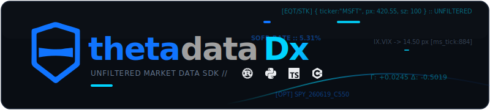

<p align="center">
  
</p>

# thetadatadx (C++)

The C++ SDK for [ThetaData](https://thetadata.us) market data. Pull US stock, option, index, and rate data three ways — point-in-time **history**, real-time **streaming**, and whole-universe **flat files** — all from a single authenticated client. Connects straight to ThetaData; nothing to install and run locally, no local proxy.

[](https://github.com/userFRM/ThetaDataDx/blob/main/LICENSE)
[](https://isocpp.org)
[](https://discord.thetadata.us/)

> [!IMPORTANT]
> A valid [ThetaData](https://thetadata.us) subscription is required. The SDK
> authenticates against ThetaData's Nexus API using your account credentials.

## Features

- **Complete coverage** — stocks, options, indices, and rates across 65 typed endpoints.
- **Three access modes** — point-in-time history, real-time streaming, and bulk flat-file downloads.
- **Typed structs, no JSON** — every endpoint returns a `std::vector` of decoded structs; prices arrive as `double`.
- **RAII throughout** — clients own their connections and clean up on scope exit; methods throw on failure.
- **Header plus a thin implementation file** — `thetadatadx.hpp` with the RAII wrappers, and `src/thetadatadx.cpp` carrying their out-of-line definitions, over a prebuilt C ABI shared library.

## Install

The SDK is a C++ header (`thetadatadx-cpp/include/thetadatadx.hpp`) plus one small implementation file (`thetadatadx-cpp/src/thetadatadx.cpp`) over a prebuilt C ABI library. Build the library once, then compile your app together with the implementation file and link the library. The CMake target below does this for you.

```bash
# Build the FFI library
cargo build --release -p thetadatadx-ffi

# Compile your app together with the implementation file and link the library
g++ -std=c++17 -Ithetadatadx-cpp/include \
    your_app.cpp thetadatadx-cpp/src/thetadatadx.cpp \
    -Ltarget/release -lthetadatadx_ffi -o your_app
```

A CMake build is provided and is the recommended path — it compiles the implementation file and links the library for you:

```bash
cmake -S thetadatadx-cpp -B build/cpp
cmake --build build/cpp --config Release --target thetadatadx_cpp
```

- **Prerequisites:** a C++17 compiler, CMake 3.16+, and the Rust toolchain to build the library.
- **Platforms:** Linux, macOS, and Windows.

## Quick start

> [!TIP]
> Pass your API key directly to the builder and you are one line from a live client. Generate a key from your [ThetaData user portal](https://www.thetadata.net/), then chain `thetadatadx::Client::builder().api_key("td1_...").connect()`. The key can also come from the environment (`.api_key_from_env()`, reading `THETADATA_API_KEY`) or a `.env` file (`.api_key_from_dotenv(".env")`). Email and password is also supported: `.email_password(email, password)` inline, or a `creds.txt` file (email on line 1, password on line 2) via `.credentials_file("creds.txt")`. Target staging with `.stage()` before `.connect()`. For full control over hosts and timeouts, build a typed `Credentials` + `Config` and call `Client::connect(creds, config)`.

```cpp
#include <thetadatadx.hpp>
#include <cstdio>

int main() {
    // Pass your API key directly. Add .stage() before .connect() for staging.
    auto client = thetadatadx::Client::builder()
        .api_key("td1_...")
        .connect();

    // First-order Greeks for every strike on SPY's 2026-06-19 expiry, as of 2024-03-15
    auto greeks = client.market_data().option_history_greeks_first_order("SPY", "20260619", thetadatadx::EndpointRequestOptions{}.with_date("20240315"));
    for (const auto& t : greeks) {
        std::printf("K=%.2f %c delta=%+.4f theta=%+.4f vega=%+.4f\n",
                    t.strike, static_cast<char>(t.right), t.delta, t.theta, t.vega);
    }
}
```

The builder accepts every credential source through one fluent chain:

```cpp
// API key from the THETADATA_API_KEY environment variable, or from a .env file
auto from_env = thetadatadx::Client::builder().api_key_from_env().connect();
auto from_dotenv = thetadatadx::Client::builder().api_key_from_dotenv(".env").connect();

// Email and password, inline
auto with_login = thetadatadx::Client::builder()
    .email_password("you@example.com", "your_password")
    .connect();
```

For full control over hosts and timeouts, build a typed `Credentials` + `Config` and connect directly. `thetadatadx::MarketDataClient` is the historical-only entry point when you do not need streaming or flat files:

```cpp
auto client = thetadatadx::MarketDataClient::connect(
    thetadatadx::Credentials::from_file("creds.txt"),
    thetadatadx::Config::production());
```

Every historical method returns a typed `std::vector` — iterate it directly:

```cpp
auto eod = client.stock_history_eod("AAPL", "20240101", "20240301");
for (const auto& t : eod) {
    std::printf("%d: O=%.2f H=%.2f L=%.2f C=%.2f\n",
                t.date, t.open, t.high, t.low, t.close);
}

auto quotes = client.stock_snapshot_quote({"AAPL", "MSFT", "GOOG"});
auto exps   = client.option_list_expirations("SPY");
```

## Streaming

Real-time streaming uses a dedicated `thetadatadx::StreamingClient` — separate from the historical `MarketDataClient`. Register a callback and switch on `event.kind`; market-data payloads (`quote`, `trade`, `open_interest`, `ohlcvc`) carry decoded `double` fields, no parsing on the hot path:

```cpp
#include <thetadatadx.hpp>
#include <cstdio>

int main() {
    auto creds  = thetadatadx::Credentials::from_file("creds.txt");
    auto config = thetadatadx::Config::production();

    thetadatadx::StreamingClient streaming(creds, config);

    streaming.set_callback([](const thetadatadx::StreamEvent& event) {
        switch (event.kind) {
            case THETADATADX_STREAM_TRADE:
                std::cout << event.trade.contract.symbol
                          << " trade price=" << event.trade.price
                          << " size=" << event.trade.size
                          << " exchange=" << event.trade.exchange
                          << " ms_of_day=" << event.trade.ms_of_day
                          << " sequence=" << event.trade.sequence
                          << " condition=" << event.trade.condition
                          << '\n';
                break;
            case THETADATADX_STREAM_QUOTE:
                std::cout << event.quote.contract.symbol
                          << " quote bid=" << event.quote.bid
                          << " ask=" << event.quote.ask
                          << " bid_size=" << event.quote.bid_size
                          << " ask_size=" << event.quote.ask_size
                          << " bid_exchange=" << event.quote.bid_exchange
                          << " ask_exchange=" << event.quote.ask_exchange
                          << " ms_of_day=" << event.quote.ms_of_day
                          << '\n';
                break;
            default:
                break;
        }
    });

    // Fluent contract-first subscriptions.
    auto stock  = thetadatadx::Contract::stock("AAPL");
    auto option = thetadatadx::Contract::option("SPY", {.expiration = "20260620", .strike = "550", .right = "C"});

    streaming.subscribe(stock.quote());
    streaming.subscribe_many({option.quote(), option.trade()});

    // ... let the callback run while events flow ...

    streaming.shutdown();   // the destructor also calls this on scope exit
}
```

Every subscription is the same value, so quotes, trades, and open interest across contracts mix freely. Or take a whole-market feed — every option trade across the universe — with no per-contract setup. The full-trade feed sends a quote and an OHLC bar before each trade, so add an `OHLCVC` case to the callback to handle the bars:

```cpp
streaming.set_callback([](const thetadatadx::StreamEvent& event) {
    switch (event.kind) {
        case THETADATADX_STREAM_OHLCVC:
            std::cout << event.ohlcvc.contract.symbol
                      << " bar open=" << event.ohlcvc.open
                      << " high=" << event.ohlcvc.high
                      << " low=" << event.ohlcvc.low
                      << " close=" << event.ohlcvc.close
                      << " volume=" << event.ohlcvc.volume
                      << '\n';
            break;
        // ...plus the quote/trade cases from above.
        default:
            break;
    }
});

streaming.subscribe(thetadatadx::SecType::option().full_trades());   // the callback runs per event — keep it fast
```

> [!TIP]
> On an involuntary disconnect the client recovers on its own — exponential
> backoff with jitter, host failover, then a paced re-subscribe of every active
> contract. `StreamingClient` is non-copyable but movable, and its destructor stops
> the stream and waits for the callback to quiesce before returning.

Prefer columns? `client.stream().batches(...)` is a sibling to the callback — the same subscriptions, delivered as Arrow record batches under a fixed schema through a native `arrow::RecordBatchReader`. Build the SDK with `-DTHETADATADX_CPP_ARROW=ON` (links arrow-cpp) to enable it:

```cpp
// `batches(...)` starts the streaming session, so open it first, then subscribe.
auto reader = client.stream().batches(/*batch_size=*/8192);
client.stream().subscribe(thetadatadx::Contract::stock("AAPL").trade());
std::shared_ptr<arrow::RecordBatch> batch;
while (reader->ReadNext(&batch).ok() && batch != nullptr) {
    std::printf("%lld rows\n", static_cast<long long>(batch->num_rows()));
}
// `reader` closes (unsubscribe + tear down) when the last reference drops.
```

## Flat files

Whole-universe daily snapshots for one `(security type, request type, date)` at a time, served by the `thetadatadx::Client`. The decoded schema follows the request type, so the wrapper emits Arrow IPC bytes — pair with arrow-cpp on the consumer side to materialise an `arrow::Table`:

```cpp
auto unified = thetadatadx::Client::connect(
    thetadatadx::Credentials::from_file("creds.txt"),
    thetadatadx::Config::production());

auto rows = unified.flat_files().option_trade_quote("20260428");
auto ipc  = rows.to_arrow_ipc();              // std::vector<uint8_t>, Arrow IPC stream

// Generic dispatcher when security type / request type come from config
auto oi = unified.flat_files().request("OPTION", "OPEN_INTEREST", "20260428");

// Or write the raw vendor file straight to disk
unified.flat_files().to_path("OPTION", "TRADE_QUOTE", "20260428", "/tmp/option-trade-quote", "csv");
```

The flat-file distribution serves a fixed set of datasets: option `trade_quote` / `open_interest` / `eod`, stock `trade_quote` / `eod`. Available `flat_files().*` methods: `option_trade_quote`, `option_open_interest`, `option_eod`, `stock_trade_quote`, `stock_eod`, plus `request(...)` and `to_path(...)`; the generic paths reject an unserved `(security, request)` pair with a typed invalid-parameter error. `thetadatadx::MarketDataClient` remains the historical-only entry point; `thetadatadx::Client` adds streaming and flat files on the same connection.

## Endpoint coverage

65 typed endpoints across stocks, options, indices, the market calendar, and interest rates, plus real-time streaming.

| Category | Endpoints | Examples |
|---|---|---|
| Stock | 16 | EOD, OHLC, trades, quotes, snapshots, at-time |
| Option | 36 | Every stock surface plus five Greeks tiers, open interest, contract lists |
| Index | 9 | EOD, OHLC, price, snapshots |
| Calendar | 3 | Market open/close, holidays, early closes |
| Interest rate | 1 | EOD rate history |

Every historical endpoint is a method on `thetadatadx::MarketDataClient`. All prices (`open`, `high`, `low`, `close`, `bid`, `ask`, `price`, `strike`) are `double`, decoded during parsing. On wildcard option queries the server fills `expiration`, `strike`, and `right`; on single-contract queries those fields are `0`. The full method list lives in [`thetadatadx.hpp`](include/thetadatadx.hpp) and the [API reference](https://userfrm.github.io/ThetaDataDx/reference/).

## Errors

Every method throws `std::runtime_error` on failure, carrying the same typed cases as every other binding — authentication, rate limit, not found, deadline exceeded, invalid parameter, and the rest.

## Tests

A Catch2 test suite lives under `thetadatadx-cpp/tests/`. Offline tests (type, null-safety, and move-semantics checks) always run; live tests round-trip against the production server and are skipped unless `THETADATADX_LIVE_CREDS` points at a `creds.txt`:

```bash
cmake -S thetadatadx-cpp -B build/cpp-tests -DTHETADATADX_CPP_BUILD_TESTS=ON
cmake --build build/cpp-tests --target thetadatadx_cpp_tests
ctest --test-dir build/cpp-tests --output-on-failure
```

## Documentation

- [Documentation site](https://userfrm.github.io/ThetaDataDx/) — getting started, API reference, streaming, flat files
- [Repository, issues, contributing](https://github.com/userFRM/ThetaDataDx)
- Community discussion on the [ThetaData Discord](https://discord.thetadata.us/)

## License

Licensed under the Apache License, Version 2.0.
