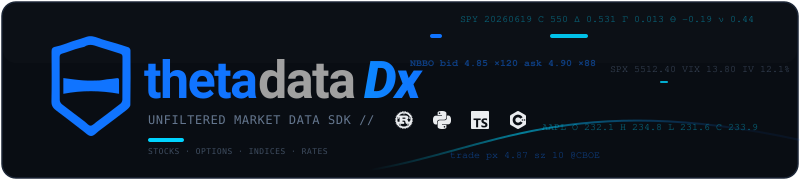

<p align="center">
  
</p>

# thetadatadx-mcp-server

MCP (Model Context Protocol) server for [ThetaDataDx](https://github.com/userFRM/ThetaDataDx) — gives any LLM instant access to ThetaData market data via structured tool calls over stdio JSON-RPC 2.0.

Speaks the `2026-07-28` revision of the protocol and still answers `2025-11-25` and `2024-11-05` clients. Call `server/discover` to read the revisions, capabilities and identity in one request.

> **FLATFILES coverage:** the MCP server advertises six FLATFILES tools — `thetadatadx_flatfile_request` plus five convenience wrappers covering the datasets the distribution serves (`thetadatadx_flatfile_option_trade_quote`, `thetadatadx_flatfile_option_open_interest`, `thetadatadx_flatfile_option_eod`, `thetadatadx_flatfile_stock_trade_quote`, `thetadatadx_flatfile_stock_eod`). Each call writes the decoded CSV / JSONL blob to disk and returns the path; the generic tool rejects an unserved `(sec_type, req_type)` pair with a typed invalid-parameter error.

## Architecture

```
LLM (any MCP-compatible client)
    |  JSON-RPC 2.0 over stdio
    v
thetadatadx-mcp-server (long-running process)
    |  Single ThetaDataDx client, authenticated once at startup
    v
ThetaData servers (market-data + streaming)
```

The server authenticates **once** at startup, keeps the `Client` client alive, and serves tool calls instantly with zero per-request auth overhead.

## Install

No install step is needed: point your MCP client at `npx -y thetadatadx-mcp-server` (see [Configuration](#configuration)). `npx` downloads a prebuilt binary for your platform (Linux and macOS on x64 and arm64, Windows on x64) and runs it on demand.

Rust users can install the binary directly instead:

```bash
git clone https://github.com/userFRM/ThetaDataDx && cargo install --path ThetaDataDx/tools/mcp
```

Or build from source:

```bash
cd tools/mcp
cargo build --release
# Binary at tools/mcp/target/release/thetadatadx-mcp-server
```

## Configuration

### Credentials

Provide ThetaData credentials via an **API key**, **email + password environment variables** (preferred), or a **creds file**:

```bash
# API key (environment variable or --api-key flag)
export THETADATA_API_KEY="your-api-key"

# Email + password environment variables (preferred)
export THETADATA_EMAIL="you@example.com"
export THETADATA_PASSWORD="your-password"

# Or a creds.txt file (line 1: email, line 2: password)
thetadatadx-mcp-server --creds ~/creds.txt
```

Credentials are resolved in this order, highest first: the `--api-key` flag, then `THETADATA_API_KEY`, then `THETADATA_EMAIL` + `THETADATA_PASSWORD`, then the `--creds` file. These are the same names the SDK and the server use.

If no credentials are provided, the server starts in **offline mode**: only `ping` is available.

### Stdio MCP clients (config file)

Most MCP clients read an `mcpServers` block from a project-local or user-level settings file. The shape is identical across clients; consult your client's docs for the exact file path. The `npx` command needs no prior install:

```json
{
  "mcpServers": {
    "thetadata": {
      "command": "npx",
      "args": ["-y", "thetadatadx-mcp-server"],
      "env": {
        "THETADATA_API_KEY": "your-api-key"
      }
    }
  }
}
```

Or with a creds file:

```json
{
  "mcpServers": {
    "thetadata": {
      "command": "npx",
      "args": ["-y", "thetadatadx-mcp-server", "--creds", "/path/to/creds.txt"]
    }
  }
}
```

If you installed the binary with `cargo install`, set `"command": "thetadatadx-mcp-server"` and drop the `npx` wrapper args.

### Cursor

Add to Cursor MCP settings (`.cursor/mcp.json`):

```json
{
  "mcpServers": {
    "thetadata": {
      "command": "thetadatadx-mcp-server",
      "env": {
        "THETADATA_EMAIL": "you@example.com",
        "THETADATA_PASSWORD": "your-password"
      }
    }
  }
}
```

### Any MCP-compatible client

The server speaks standard MCP over stdio:
- **stdin**: one JSON-RPC 2.0 request per line
- **stdout**: one JSON-RPC 2.0 response per line
- **stderr**: structured logs (configurable via `RUST_LOG` env var)

## Available Tools

Every generated market-data endpoint plus 1 offline tool (`ping`) and, when connected, 5 streaming tools, 6 flat-file tools and `entitlements`. The counts below are the full surface; what a given account is shown depends on the tiers it holds.

### Offline (1 total: `ping`)

This tool does not require a ThetaData account or a network round-trip; it is available even when the server is started in offline mode.

- `ping` - server status

### Stock Data (13 tools)
- `stock_list_symbols`, `stock_list_dates`
- `stock_snapshot_ohlc`, `stock_snapshot_trade`, `stock_snapshot_quote`, `stock_snapshot_market_value`
- `stock_history_eod`, `stock_history_ohlc`, `stock_history_trade`, `stock_history_quote`, `stock_history_trade_quote`
- `stock_at_time_trade`, `stock_at_time_quote`

### Option Data (34 tools)
- `option_list_symbols`, `option_list_dates`, `option_list_expirations`, `option_list_strikes`, `option_list_contracts`
- `option_snapshot_ohlc`, `option_snapshot_trade`, `option_snapshot_quote`, `option_snapshot_open_interest`, `option_snapshot_market_value`
- `option_snapshot_greeks_implied_volatility`, `option_snapshot_greeks_all`, `option_snapshot_greeks_first_order`, `option_snapshot_greeks_second_order`, `option_snapshot_greeks_third_order`
- `option_history_eod`, `option_history_ohlc`, `option_history_trade`, `option_history_quote`, `option_history_trade_quote`, `option_history_open_interest`
- `option_history_greeks_eod`, `option_history_greeks_all`, `option_history_trade_greeks_all`
- `option_history_greeks_first_order`, `option_history_trade_greeks_first_order`
- `option_history_greeks_second_order`, `option_history_trade_greeks_second_order`
- `option_history_greeks_third_order`, `option_history_trade_greeks_third_order`
- `option_history_greeks_implied_volatility`, `option_history_trade_greeks_implied_volatility`
- `option_at_time_trade`, `option_at_time_quote`

### Wildcard Option Queries

For option tools, MCP uses `"0"` as the wildcard value for `strike` and `expiration`.

- Use a pinned strike like `"strike":"385"` when you want one contract.
- Use `"strike":"0"` when you want a bulk chain-style response with contract identification fields on each row.
- `strike_range` filters a wildcard bulk selection around spot / ATM. It does **not** fan out a pinned strike into neighboring strikes.

This matches the current JVM terminal behavior. The v3 REST surface uses `*` for the same wildcard concept; the MCP server uses `"0"` because it follows the underlying SDK contract.

### Index Data (9 tools)
- `index_list_symbols`, `index_list_dates`
- `index_snapshot_ohlc`, `index_snapshot_price`, `index_snapshot_market_value`
- `index_history_eod`, `index_history_ohlc`, `index_history_price`
- `index_at_time_price`

### Calendar & Rates (4 tools)
- `calendar_open_today`, `calendar_on_date`, `calendar_year`
- `interest_rate_history_eod`

### Live Feed (5 tools)

Advertised only when a client is connected. The endpoint tools return what the vendor serves at the moment you ask; these hold live subscriptions and answer what happened between two moments.

- `stream_read` - one contract and one kind of tick: the rows that arrived since your last read of it, the age of the newest row returned, how far back the rows held reach, and whether anything is missing from the interval asked about
- `stream_prints` - each trade on a contract paired with the quote that stood before it, as the feed delivered them
- `stream_market` - every trade across the whole option or stock market from one subscription, narrowed and ranked on the vendor's own fields as the prints arrive
- `stream_list` - what is held, whether each buffer is still on the feed, and when each will be released
- `stream_stop` - close one now

A buffer is a contract and a kind, opened by the first read of it and closed once fifteen minutes have passed without any of these tools using it, by the next call to one of them rather than on a timer, so nothing is released while the server sits idle. Using is wider than reading: a `stream_prints` call keeps the trade and quote legs it reads from alive without moving either one's window. The first `stream_read`, `stream_prints` or `stream_market` on a contract nothing was watching returns nothing yet and the second returns what arrived in between; a `stream_prints` on a contract `stream_read` already holds for its trades has them straight away, without the quotes beside them. `stream_list` and `stream_stop` answer immediately. The rows carry the vendor's condition and exchange codes as they arrived, and the vendor's own bar is served as the vendor sent it, with the age of that bar beside it. Two things on this surface are computed rather than sent, and the tool returning each says so. `spread`, ask minus bid, which `stream_market` can narrow and rank on and which is never a column on a row. And a `market_value` row in full: the vendor sends the underlying quote, and `market_bid`, `market_ask` and `market_price` are derived from it by the size-imbalance rule the vendor's own terminal uses, so they are a theoretical market value and not the quote. A quote or bar carried inside an answer has its own `age_ms` beside it, which is the age of that row and not of the answer.

A stream subscription is scoped to the account rather than to the connection, so `stream_stop` stops the stream for every application on that account.

### Entitlements (1 tool)

Advertised only when a client is connected.

- `entitlements` - the subscription tier held for each asset class, which is what decides the rest of the tool list

### Flat Files (6 tools)

Advertised only when a client is connected, and by class: an account with only a stock tier sees the stock ones and the generic request, not the option ones. Each pulls a whole-universe daily blob, writes it to disk as CSV or JSON Lines, and returns the written path.

- `thetadatadx_flatfile_request` - generic flat-file request for a served `(sec_type, req_type)` pair; an unserved pair is rejected with a typed invalid-parameter error
- `thetadatadx_flatfile_option_trade_quote` - option trade-quote flat file
- `thetadatadx_flatfile_option_open_interest` - option open-interest flat file
- `thetadatadx_flatfile_option_eod` - option end-of-day flat file
- `thetadatadx_flatfile_stock_trade_quote` - stock trade-quote flat file
- `thetadatadx_flatfile_stock_eod` - stock end-of-day flat file

## Example Tool Calls

### List tools

```json
{"jsonrpc":"2.0","id":1,"method":"tools/list","params":{}}
```

### Fetch AAPL end-of-day data

```json
{"jsonrpc":"2.0","id":2,"method":"tools/call","params":{"name":"stock_history_eod","arguments":{"symbol":"AAPL","start_date":"20240101","end_date":"20240301"}}}
```

Response:
```json
{"jsonrpc":"2.0","id":2,"result":{"content":[{"type":"text","text":"{\"ticks\":[{\"date\":20240102,\"created\":72000000,\"last_trade\":57600000,\"open\":187.15,\"high\":188.44,\"low\":183.89,\"close\":185.64,\"volume\":82488700,\"count\":1036575,\"bid_exchange\":65,\"bid\":185.63,\"bid_condition\":0,\"ask_exchange\":65,\"ask\":185.65,\"ask_condition\":0,\"bid_size\":1,\"ask_size\":3},...],\"count\":41}"}]}}
```

### Fetch bulk option Greeks around ATM

```json
{"jsonrpc":"2.0","id":5,"method":"tools/call","params":{"name":"option_history_greeks_eod","arguments":{"symbol":"SPY","expiration":"20230120","strike":"0","right":"C","start_date":"20221219","end_date":"20221220","strike_range":5}}}
```

This returns a filtered bulk response across multiple strikes. If you change `strike` to `"385"`, the response is limited to that single contract.

### Check server status

```json
{"jsonrpc":"2.0","id":4,"method":"tools/call","params":{"name":"ping","arguments":{}}}
```

## Logging

Set `RUST_LOG` to control verbosity:

```bash
RUST_LOG=debug thetadatadx-mcp-server       # verbose
RUST_LOG=warn thetadatadx-mcp-server        # quiet
RUST_LOG=thetadatadx=debug thetadatadx-mcp-server  # just the library
```

All logs go to **stderr**, never stdout (which is reserved for JSON-RPC).

## License

Apache-2.0 -- see [LICENSE](../../LICENSE).
